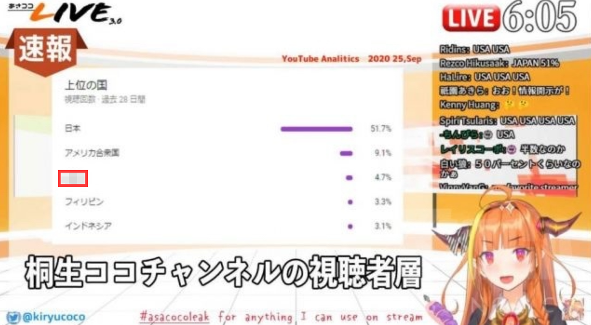
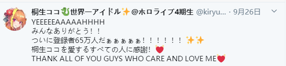

# 主要事件

## 01

晨间，hololive所属的虚拟主播桐生可可，在其发布的自制节目“早安可可”视频中1，讨论到粉丝国际分布并配有油管后台数据配图2，导致其B站直播间被封禁一个月。

1. 该节目绝大部分素材由桐生可可自主收集与准备，早前该节目因涉及穆斯林话题被禁播一段时间。

2. 此配图为Youtube后台数据配图，日文版标题“上位の国”，可简单理解为“热门国家”，请勿因中日汉字差异发散联想。

## 02

受事件1影响，除holocn所属成员外，hololive全社成员在B站的转、直播被暂停一个月，相关活动被取消。

### 业务受到较大影响的主播

- 白上吹雪：B站直播收益较多，有若干国内工商业务。

- 湊阿库娅：B站直播收益较多；有若干国内工商业务；按惯例预计有国庆B限连播计划；被发现近期有大量私下LOL练习，预计有meaqua联动或其他计划；近期B站粉丝热切希望新衣装B限。

- 亚琦罗森：较多B限直播，与B站翻译组有较多互动，近期预备与翻译组联合投稿。

- 星街彗星：B站直播收益较多。

### 其他影响

hololive所属主播均有失去了预定原神工商的可能性存在，此事在夏色祭小号与小鸟游琪亚拉的推特中略有提及。

## 03

事件1所提及该期“早安可可”视频因炎上趋势被隐藏，桐生可可在白天未出现。此时事件虽有炎上趋势，但仍存在大量国内观众认为此事为桐生可可无心之失。而视频被隐藏一事被观众初步认定为桐生可可已知被炎上却仍无动于衷，为后续事态的发展埋下了伏笔。

## 04

晚间，桐生可可开启壶男游戏直播，直播间出现部分中国观众向其讨要说法，在直播间部分别有用心之人的蓄意煽动下，直播间评论区产生混乱，随后桐生可可开启会员限定发言继续直播，直播期间并未对事件1作出相关解释，且删除了部分中国观众的留言。

## 05

直播结束后，桐生可可在推特上表示将尽快恢复被隐藏视频且庆祝自己65万粉丝达成一事，随后被隐藏的“早安可可”视频被恢复重新上传，但敏感部分已剪辑。此时，桐生可可毫无悔过之意的观点在部分中国观众内达成共识，多数中国观众仍不知情。

