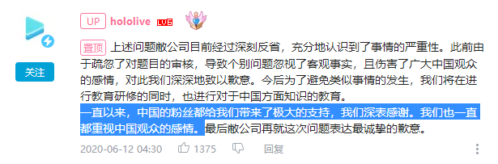

# 01

晚间，桐生可可开启会员限定发言直播，直播内容为杂谈，在直播期间桐生可可对直播间频繁出现的涉政敏感言论毫不回避，虽然身处炎上时期，但因为其对自身不惧压迫的形象塑造及对某些地区观众的刻意迎合，使得同接、SC收益及粉丝数均得到增长。

至此，结合hololiveEN出道在欧美地区大火的背景，桐生可可因业务市场空间遭挤压，个人社内地位受到动摇，不顾同事心情与业务，蓄意制造涉政话题以迎合国外观众，为自身获得利益的观点在国内观众间已基本形成。

# 02

炎上事件持续发酵，关于事件的始末开始在B站及各论坛流传开来，部分冷静的观众希望大家在holo官方出面澄清前保持克制。

[相关链接：【9.25桐生可可与holo炎上事件】](https://www.bilibili.com/read/cv7737124)

# 03

B站hololive全社成员开始大量掉粉1，包括石油佬2在内的部分破防3粉丝开始退圈。

1. 白上吹雪与湊阿库娅因其长期以来在B站努力经营的原因而掉粉缓慢，亚琦罗森因为粉丝的宣传让其成为hololive主播中唯一一位在此事件中反向涨粉的存在。

   [相关链接：【9.27 受桐生可可影响的hololive官方账号粉丝变化】](https://www.bilibili.com/read/cv7755081)

2. 【石油佬】即给主播打了大量打赏的粉丝，网络舶来词，同“石油王”

3. 【破防】可理解为由于某事的打击导致情绪低落濒临崩溃。

# 04

hololive本社于本日仍在观望，在错过企业危机公关的“黄金时间”与“垃圾时间”后，成功再次进入“hololive公关时间”1。

1. 除此次事件外，hololive亦发生过数次炎上事件，均反应迟钝。

