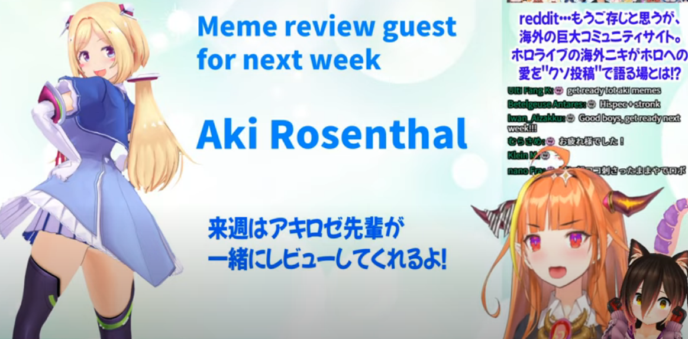
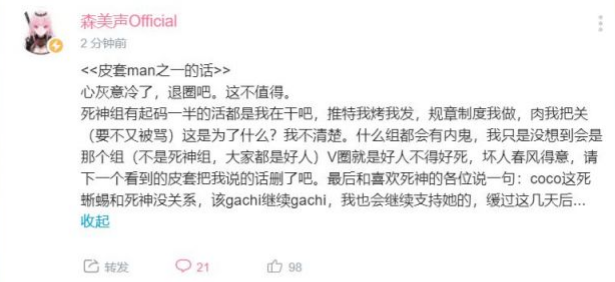
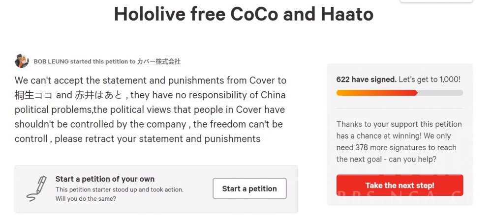
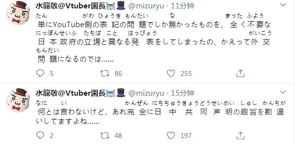
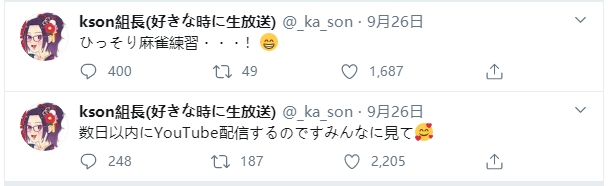

# 01

桐生可可和萝卜子联动，被国内观众视为“演者盾”1，直播末尾放出下周与亚琦罗森联动的通知。

1. 【演者盾】可理解为在炎上事件中，通过其他无辜主播出面发声、直播或联动来博取观众同情，最后达到消除影响，抑制炎上的手段。此种方式虽受观众与主播所不耻，但的确很有效。

# 02 

森美声官组皮套man1率先发声退圈，HololiveCN成员发声“坚持立场与底线”。

1. 【皮套man】字幕组工作岗位之一，主要职责为使用官方账号收集、转发主播相关信息，并与B站粉丝在动态中进行互动等，类似于官方发言人的角色。

# 03 

晚间，hololive就此次事件发布道歉声明，此份道歉声明强调了“一个中国”原则，但仅在B站发布，无国外版本。随后发布对涉事主播的处罚决定，对主播赤井心与桐生可可两人进行了为期三周的暂停活动处罚。

## 国内观众对公告表示不满

1. 道歉声明仅在B站发布，处罚决定中未声明“一个中国”原则。

2. 处罚决定外文版中使用了“民族主义”等负面用词，出现了“部分地区”等措辞错误。

3. 两人性质不同但受到同等处罚，且对主播桐生可可的处罚过轻。

4. 处罚决定中声明处罚原因为主播泄露公司机密，holo本社未真正认识到错误所在。

## 国外观众对公告表示不满

1. 两位主播均没有错误，不应受到处罚。

2. hololive本社无底线无尊严。

在公告发布后，bilibili、桐生可可、hololive、台湾等词条迅速登上热搜趋势榜。

综上，炎上事件进一步升级，hololive受到国内外观众的一致抵制。

[相关链接：【9.27 hololive “阴阳公告”事件】](https://www.bilibili.com/read/cv7816359)

**外国粉丝为两位主播发起集体请愿**

**少数观众不明白作为一家日企的hololive为何不按《中日和平友好条约》行事**

# 04

两位主播在推特上发布道歉声明，桐生可可声称“会认真对待此事”。但被网友迅速扒出其中之人1账号kson在昨日发布的近期连续直播预告。

1. 【中之人】即使用虚拟主播形象的实际演员，皮套下面的人，亦称“演者”或“liver”。

**昨日的提前预告被观众认定为桐生可可的无缝切换直播计划**

# 05

B站桐生可可官组发布解散声明，删除频道内所有相关内容。B站超活跃非官方字幕组桐生会发布解散动态，同时更名为“过去的协会”。

[相关链接：【-桐生可可字幕组解散声明-】](https://www.bilibili.com/read/cv7759311)

[相关链接：【桐生会解散动态】](https://t.bilibili.com/439367522230285780)

# 06 

B站hololive相关的大部分主播的官方字幕组进入不活跃状态，大量字幕组成员开始流失1。

1. B站字幕组是hololive得以发展壮大的重要助力，他们往往由普通粉丝组成，阵容庞大、专业、热情且不求任何物质回报，是“用爱发电”这一概念的典型代表，但同样的，在炎上事件发生时，他们身处于观众与官方之间往往会受到更大更多的打击。

# 07 

宝钟玛琳相关非官方字幕组—宝钟玛琳保护协会—发布活动方针变更声明，声明强调“投稿活动正常进行，且不承认《holo二次创作条例》”1，其他相关非官方字幕组跟进转发，国内粉丝戏称“大航海时代”开始2。

[相关链接：【关于敝组今后活动方针变更的说明】](https://t.bilibili.com/439751067099735895)

1. 《二创条例》可简单理解为非官组不能与官组投稿内容冲突，在视频内容选择上没有优先权，且只能发布当日1个月前的直播内容。

2. 日本称盗版为“海贼版”。

# 08

NGA论坛关于此次事件的集中讨论专楼建立，该专楼短时间内迎来了大量人气，在讨论中逐渐形成一套“萌萌人1如何转化为乐子人2”的理论，成为了乐子人的重要据点之一3。

1. 【萌萌人】原意指放弃独立思考，只希望在直播中获得温暖与快乐，对主播所做的一切甚至于过分的行为都持全肯定与包容态度的人。在此次事件中所指的萌萌人不尽相同，主要体现为全肯定程度减轻，在炎上态度愈演愈烈的现在仍持理解态度的保守派。

2. 【乐子人】原意是指唯恐天下不乱，没有立场倾向，只求制造炎上事件或在炎上事件中获取快乐的人。在此次事件中所指的乐子人不尽相同，主要体现为混乱程度减轻，打击面缩小，打击范围限定在hololive与桐生可可之间的激进派。

3. 本人除B站以外较少关注其他平台，参与NGA论坛也是因此次事件所致，对其他参与此次事件的平台了解甚少，故其他平台在此及后文中不提及，若有老哥清楚的可在评论区科普。

# 09

油管上由国人组建的27万人气hololive非官方频道HoloLive Moments1取关桐生可可，并将所有视频隐藏，但随后恢复，此番操作后被国内观众炎上2，频道创建人无敌飞雪退圈。

1. HoloLive Moments简称HLM，在hololive于油管的推广过程中发挥了较为重要的作用，是B站hololive相关二创作品传播至油管的重要途径之一。

2. 此事据传另有隐情，详见[09.28事件2](../20200928/README.md#02)。

# 10

部分观众发现原神游戏中将“桐生可可”一词屏蔽。

# 11

hololive本社发布新的小剧场动画，中文名“以动物首领为目标”，英文名“龙是不可战胜的”。

[相关链接：【hololive小剧场】以动物首领为目标](https://www.bilibili.com/video/BV1o5411L73B)

**27日阴阳公告后发布的小剧场动画令人难以捉摸**