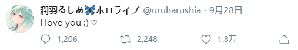
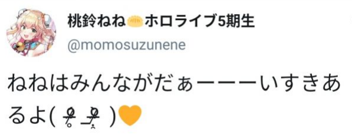

# 01

HLM再次隐藏所有视频，并发布英文版停止活动声明，该文章澄述了频道停止原由、hololive在B站的历史与收益、B站粉丝的感受等，文章发布后频道订阅数锐减，评论区被外国观众的“good riddance”、“who cares?”等负面评论所淹没，部分萌萌人受此影响恶堕为乐子人。

[相关链接：【Hololive Moments 的声明（中文翻译）】](https://www.bilibili.com/read/cv7794013)

# 02

字幕组圈内活跃人员瞳人形以个人角度讲述HLM背后隐情，并表示淡圈。

[相关链接：【关于HLM，之前一些操作的背后，以及现状】](https://bbs.nga.cn/read.php?tid=23517233)

# 03

经国内观众自发讨论，以下主流诉求基本成型（2选1）

- 桐生可可被开除或者被毕业

- hololive退出中国市场

# 04

国外观众气氛高涨，在Youtube、Reddit、Twitter、Pixiv等主流站点通过文字、视频、画作等方式声援主播赤井心与桐生可可，“coco did nothing wrong”一时间成为随处可见的口号。

# 05

NGA论坛乐子人专楼中逐渐形成了以“不想赢就不会输”为中心思想，以“没有组织就是最灵活的组织”的去中心化为结构，以“不转移矛盾目标、不随意扩大战场、不分散斗争精力、不盲目悲观乐观”为行动方针的群众自发组织。在恪守“不进行物理层面上的攻击”为底线的前提下，以灵活多样且无所不用其极的手段，以“获取快乐”为目的向条目4所提到的平台中有关于桐生可可的部分发起了舆论攻击。

# 06

以B站为主的平台涌现大量事件相关文章与视频，数小时一份的产出速度让此次炎上事件得到持续加温，事件也开始出现破圈现象。

# 07

疑似为安抚欧美市场粉丝，hololive示意旗下主播使用演者盾

