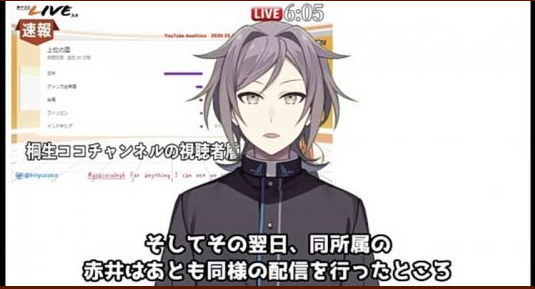
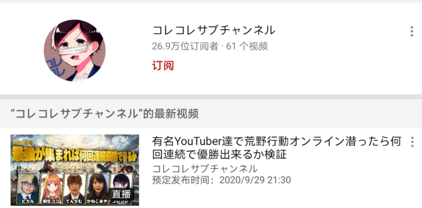
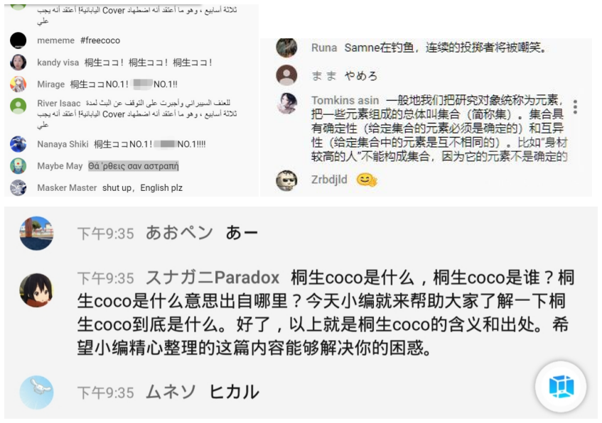
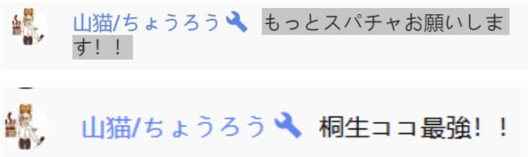
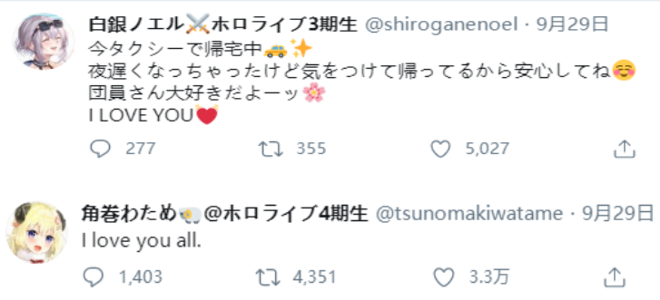
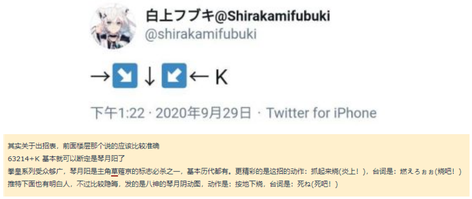
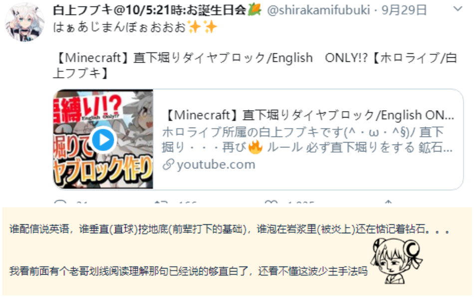

# 01

人民日报海外版发布关于此次炎上事件的相关报道1。

[相关链接](https://zhuanlan.zhihu.com/p/260367068?night=1)

1. 此报道略有错误，其中提到主播赤井心在提及台湾时放出相关旗帜配图，实际上为国外视频主二次创作添加。

# 02

某地区观众在当地的巴哈姆特论坛、PTT论坛等平台形成据点，对NGA论坛乐子人专楼的内容进行分析并发布于国外主流社交平台，希望与国外观众达成一致观点共同行动。

# 03

晨间，NGA论坛发现手游GBF在游戏时拥有高频率推特发布功能，论坛乐子人纷纷开始利用该功能对桐生可可相关TAG进行无关内容轰炸，数个相关TAG迅速沦陷失去正常交流功能。同时，大量乐子人以引发争论为目的，在国外平台进行角色反串扮演，一时间国外平台敌我难辨，风声鹤唳。

# 04

星街彗星、白上吹雪等被认为与B站互动较多的主播，其油管订阅数在近期开始反复波动。

# 05

夏色祭推特小号近期发布负能量推文，姬森璐娜在直播中提到“或许我的人气今后再也涨不上去了”并苦笑，hololive旗下主播开始或多或少出现破防现象1。

1. 过度解读可能性存在，姬森璐娜发言暂未找到来源。

# 06

专注虚拟主播圈负面新闻，自身风评不佳的日本虚拟主播鸣神裁发布对此次炎上事件的看法，讲解中出现时间线错误，但大致讲清楚了来龙去脉。日本方面的观众在各种科普下也逐渐理解此次事件的复杂性。

**被许多V圈粉丝所厌恶的鸣神裁难得“理中客”了一把**

# 07

晚间，hololive本社临时召集主播进行网上会议，具体参与人数不明，具体讨论内容不明，多位主播时间安排受影响并发布计划调整通知。

# 08 

晚8点半，一日本主播开启手游荒野行动直播预告，直播预告中出现桐生可可头像，此消息迅速传回NGA论坛，一众乐子人纷纷前往该直播间进行无组织高强度刷屏，直播间一时与国内某直播平台情形无二。

**该日本主播有数次蹭热度的记录**

**令人哭笑不得的“小编体”**

同时，大量桐生可可的支持者闻讯也赶来该直播间，使用新台币为主进行了若干SC打赏，该直播间房管受此影响，不嫌事大地开始了拱火行为，一时间热闹非凡。

**油管直播间的管理员被国内观众称作“扳手”**

直播开始后，主播表示桐生可可今天有事无法出现在直播间，并再次感谢大家的捧场与打赏。事后，NGA乐子人们将这次日本乐子人的钓鱼直播称作“演习”，认为在这次直播中预演了今后桐生可可直播间的景象。

**“只有他们受伤的世界达成了”**

# 09

疑似为安抚欧美市场粉丝，hololive再一次示意旗下主播使用演者盾

**企业势常见的“演者盾”**

# 10

白上吹雪于本日发布的推文与活动均被指有隐晦含义，当然也存在有过度解读可能。

**白上吹雪作为hololive元老级人物，在B站拥有庞大的粉丝群体（相对于hololive其他主播）**

**不建议大家作过多的阅读理解**