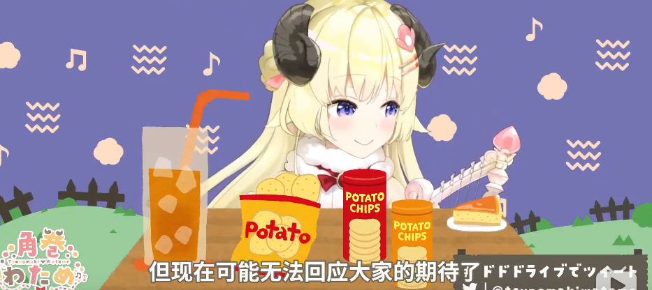

# 01

上午，hololive发布关于9月27日公告的补充说明，说明内容精简如下

- 处罚决定是以安抚观众、抑制炎上为目的出发的。

- 前份公告的中文版是在B站方面的指导下撰写的。

- 对公司董事长谷乡元昭进行罚薪处理。

- 设立专项委员会负责对本社主播的敏感内容教育。

另，在该份推特下附有两条hololive官方发布的补充内容

- 对各主播直播间设定敏感词屏蔽列表。

- 各主播在直播中若涉及敏感问题，请观众预先理解，主播的发言没有政治、社会意图。

中文公告：[第一页](img-supplement-zh-01.png)，[第二页](img-supplement-zh-02.png)。[来源](https://cover-corp.com/2020/09/30/093003/)。

英文公告：[第一页](img-supplement-en-01.png)，[第二页](img-supplement-en-02.png)，[第三页](img-supplement-en-03.png)。[来源](https://cover-corp.com/2020/09/30/093002/)。

日文公告：[第一页](img-supplement-jp-01.png)，[第二页](img-supplement-jp-02.png)。[来源](https://cover-corp.com/2020/09/30/093001/)。

Cover声明，如公告的不同语言版本之间有歧义，以日文版本为准。

# 02

国内观众在讨论后对上述公告基本形成统一观点：该份公告对炎上事件的根源问题没有作出解答，hololive本社未进行深刻反省，反而存在推卸责任之嫌，该份公告的实际作用是安抚欧美市场观众。同时坚定了国内观众对hololive退出中国市场之诉求的决心。

# 03

在随后的直播中，hololive所属各主播在直播过程中均对评论栏进行了撤销或遮挡处理，对涉及敏感问题的评论与SC也极为谨慎的忽略。部分地区观众在使用新台币进行SC打赏时发现被系统自动拒绝，该部分观众产生了不同程度的破防现象，极端者恶堕为乐子人开始对hololive进行舆论攻击。

# 04

受近期事件影响，角卷绵芽在晚间直播中情绪低落，在接收到观众安慰后更是几度落泪，而此次直播中仍有部分观众使用评论、SC等手段妄图诱使主播进行敏感问题发言。

**同为四期生的角卷绵芽在此次事件中的处境十分为难**