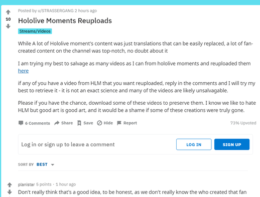
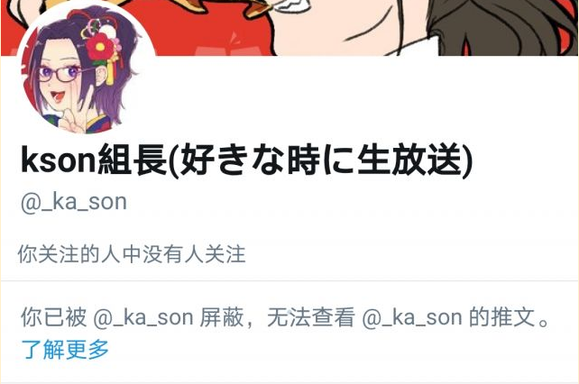
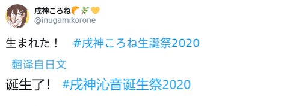
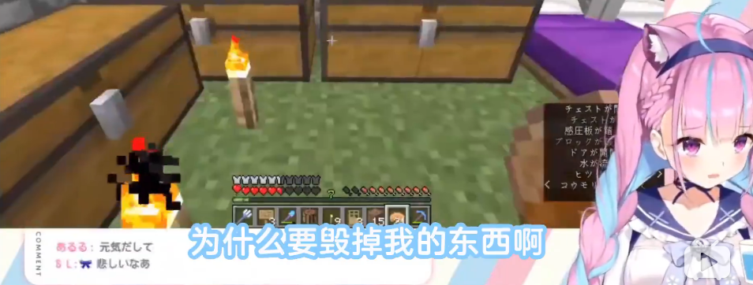

# 00

本文件收录20201001-20201004事件，原文如此。如有更多详情，欢迎添加并新建文件夹。

# 01

近期hololive本社对炎上事件一直保持冷处理态度。

# 02

各方面观众情绪开始回落

- hololive所属主播B站掉粉趋势有所缓解，小部分官组开始缓慢更新视频。NGA乐子人提出乐子行为常态化，抛弃速胜想法，做好长期准备，为19号复播积蓄力量；

- 欧美市场部分观众开始统一以“love&peace”态度回应争执；

- 日本市场部分观众开始保持中立。

# 03

少数欧美油管主妄图剽窃HLM视频私自上传，HLM隐藏视频而不删除就是对此的预先防备，准备随时向油管官方举报。

**“I know we like to hate HLM but good art is good art”**

# 04

桐生可可中之人KSON账号疑似有上线行为，拉黑屏蔽了部分乐子人观众。

**事件最重要的主人公迟迟不出现**

# 05

噶呜古拉1在删档歌回中演唱歌曲《judgement》，并表示该首歌曲“for coco senpai”，引起小范围炎上趋势，但该行为存在双向解读可能性导致观众无法确定其性质。

1. 噶呜古拉为桐生可可在欧美市场方向最强力的竞争者。

**以惊人速度崛起的英语向主播**

# 06

戌神沁音1发表生日庆祝推文，hololiveCN所属希薇娅与阿媂娅均向其表示祝贺，在长时间未回复后引起小范围炎上趋势，在回复后趋于稳定，截止10.05，仍有包括部分EN组成员及本部成员的生日祝贺未回复。

1. 戌神沁音在以往的直播中表现的对B站方面十分友好，也是率先向B站字幕组发出诚挚感谢的holo本社成员，只能说在这次大炎上的环境中，所有观众都变得敏感，许多曾经不起眼的行为在此时此刻都显得意味深邃。

**简简单单的庆生推文下是混乱不堪的评论**

# 07

湊阿库娅1在MC直播中遭遇苦力怕袭击，炸毁了正在修建的部分建筑，平日乐观开朗的她在直播中一反常态的心态崩溃开始抽泣并控诉。

[相关链接：【熟肉】【湊あくあ】气哭的委屈阿夸](https://www.bilibili.com/video/BV1j54y1k7HL)

1. 湊阿库娅可能是在本次炎上事件中损失最大的无辜主播。

**连迟到道歉视频都要整活的湊阿库娅少见的破了防**