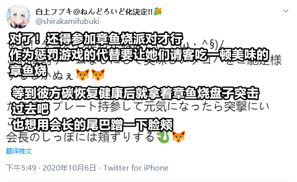
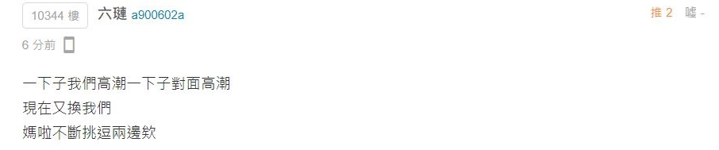
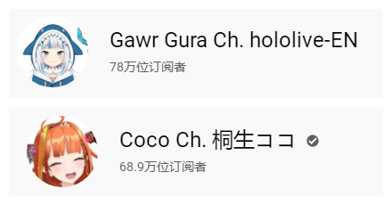

# 01

10月06日，天音彼方发布住院消息1。

1. 天音彼方与桐生可可在今年成为了同居室友，在本次事件中处境极为尴尬，反而让这次令人担忧的住院显得有些祸福相依。

# 02

接上条，白上吹雪发推探望天音彼方，文末提到“想用桐生会长的尾巴蹭一下脸颊”，引起B站粉丝炎上，关于本条推文的阅读理解讨论十分激烈1。

正向解读

- [【白上吹雪发推提及桐生可可，为了守护天音彼方的无奈之举】](https://www.bilibili.com/read/cv7862141)

- [相关链接：【10.6白上吹雪的推特解读】](https://www.bilibili.com/read/cv7863094)

反向解读

- [相关链接：【白上吹雪站队桐生可可】](https://www.bilibili.com/read/cv7860795)

1. 过度解读在直球声明面前是苍白无力的，但对于白上吹雪的推文解读在粉丝群体中很受欢迎，国外亦然。

# 03

接上条，大量粉丝涌入白上吹雪官组最新动态1下进行负面评论，官组采取高强度控评拉黑措施2，引起B站粉丝炎上，白上吹雪及其他hololive所属虚拟主播再次掉粉3。

1. 白上吹雪官组在9.26~10.10期间一直处于不活跃状态，仅在白上吹雪生日当天发布了一份生贺视频，该视频工作量较大，是在9.25事件前就已着手准备的工作，但在白上吹雪生贺直播中没有被提及。官组亦没有发布其他新动态，所以此生贺视频评论区成为了炎上讨论区。

2. 本次控评拉黑强度极高但持续时间并不长，许多老粉与无关言论均被波及，部分观众怀疑使用了“云黑名单”等科技手段。

3. 至10.05，因桐生可可事件导致的holo主播全体掉粉趋势已趋于平缓，白上吹雪与湊阿库娅粉丝数已回升至原水平。[相关链接：【2020.10.6 白上吹雪事件后hololive各账号粉丝数据的简单报告】](https://www.bilibili.com/read/cv7868473)

# 04

至此，因冷处理而趋于平息的事态再次得到加温，部分粉丝退圈，部分粉丝恶堕为乐子人，“hololive退出中国市场”的论调再次成为主流导向。

**沉迷阅读理解的某地区观众亦表示心力交瘁**

# 05

10月6日，作为欧美市场上的实际竞争对手，噶呜古拉订阅数超越桐生可可。

**配图数据截至10.10**

# 06

国庆长假期间，于B站运营的各方虚拟社团与个人势均呈大活跃态势，个别hololive所属主播在发布推文时开始主动翻译成英语。