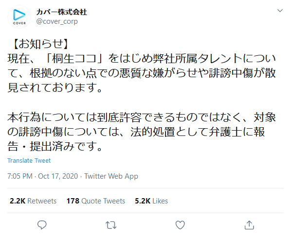
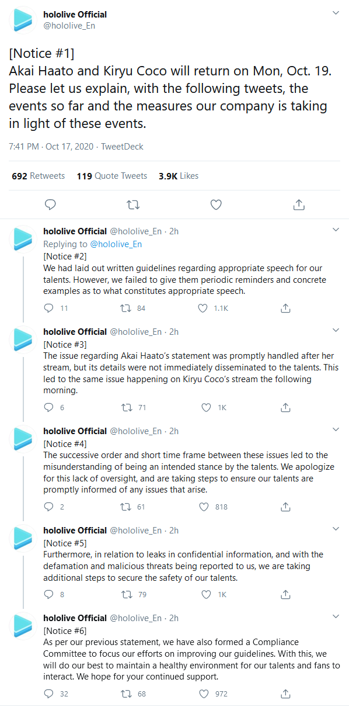
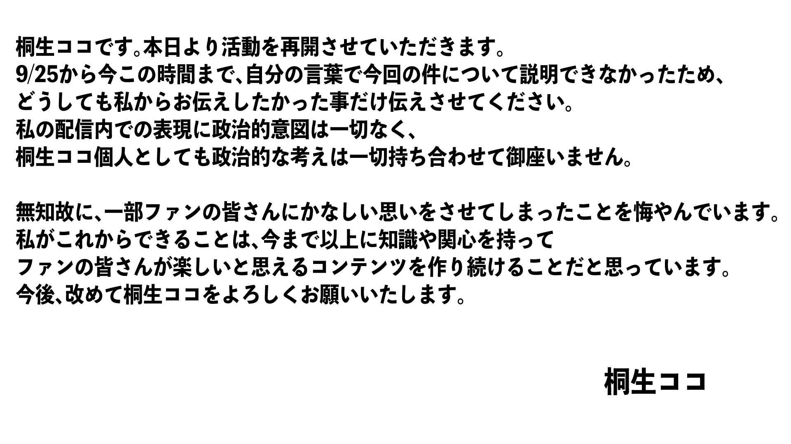
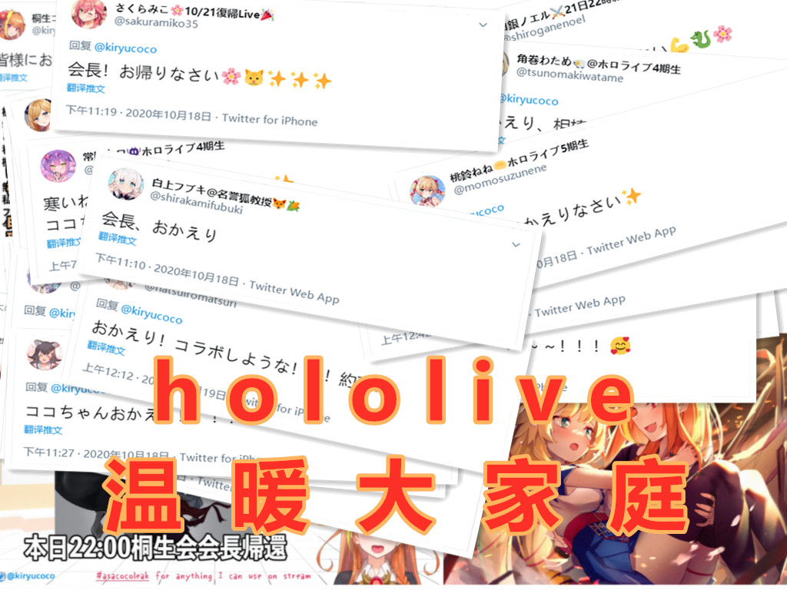

# 01

Cover于[公司官方Twitter账号](https://twitter.com/cover_corp)、[B站官方账号](https://space.bilibili.com/286700005/dynamic)、[英文Hololive Twitter账号](https://twitter.com/hololive_en)同步发表最新通告。

**此通告截至本文最后更新时间，仍未在Cover官方网站发表。**

## 日文通告

**日文通告，额外声明将对威胁及诽谤中伤者采取法律行动**

原始链接

- [第一条](https://twitter.com/cover_corp/status/1317631969887318016)
- [第二条](https://twitter.com/cover_corp/status/1317631971149840385)
- [第三条](https://twitter.com/cover_corp/status/1317631972479365121)
- [第四条](https://twitter.com/cover_corp/status/1317631998265942017)
- [第五条](https://twitter.com/cover_corp/status/1317631999746560001)
- [第六条](https://twitter.com/cover_corp/status/1317632000941981696)
- [第七条](https://twitter.com/cover_corp/status/1317632788292497408)

## 英文通告

**英文通告，仅有六条**

原始链接

- [第一条](https://twitter.com/hololive_En/status/1317641891140096001)
- [第二条](https://twitter.com/hololive_En/status/1317641988171132929)
- [第三条](https://twitter.com/hololive_En/status/1317642072648609792)
- [第四条](https://twitter.com/hololive_En/status/1317642164713578498)
- [第五条](https://twitter.com/hololive_En/status/1317642244896161792)
- [第六条](https://twitter.com/hololive_En/status/1317642308901236736)

## 中文通告

**中文通告，与英文通告基本一致**

原始链接

- [B站动态](https://t.bilibili.com/447296826428115628)

备注：本条与主要参考文献的资料相同，故不做更改

# 02 在持续了3个星期的炎上之后，cover仍将桐生可可的行为定义为无意之举。再次引发国内观众对其不满的情绪，10.19复播在即，国内观众意识到，对于此次事件结果的诉求与实际情况之间有着巨大的落差。

经过一个白天的信息传播，B站hololive圈内的紧张气氛达到了一个峰值。

# 03 此公告发布后，各方对于第7条【律师函】的看法。

- 部分国内观众：这条甚至没在B站发，又搞阴阳公告，是针对国外的，应该是用以安抚国外观众情绪。
- 部分日本观众：可能是针对“桐生可可炎上事件”的anti，也可能是针对“清洁工炎上事件”的anti。
- 部分欧美观众：cover干的好，桐生可可的anti们应该都收到律师函了。

Anti一般指黑粉。

# 04 桐生可可Twitter账号发布回归声明

**回归声明**

来源：[推文](https://twitter.com/kiryucoco/status/1317844576682475522)。

五分钟后，赤井心Twitter账号同样发布[回归声明](https://twitter.com/akaihaato/status/1317846343138770950)。

图片存档[见此](img-haato-return-notice.jpg)。

**大变申没有大变，等于没有道歉。田中都比你有诚意”--语出ywwuyi**

# 05 白上吹雪及其他成员发布欢迎回归的消息。此类消息被大量观众视为表态。

除湊阿库娅、润羽露西娅、兔田佩特拉、Azki、姬森露娜、夜空梅露、猫又小粥、百鬼绫目、大空昴之外的所有人，均发推祝贺。

