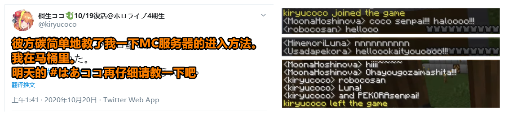

# 01 

**桐生可可凌晨MC突击佩克拉事件**

10月20日凌晨，跟MC几乎绝缘的桐生可可进入hololive MC服务器内向在场主播打招呼后下线，推特发布相关消息。

如果大家仍持续关注的话应该在近期可以看到桐生可可投身hololive MC大家庭建设的温馨景象。

桐生可可进入MC时，分别有兔田佩克拉、姬森露娜以及穆娜·霍希诺娃（holo印尼所属）在场，穆娜对桐生可可的到来非常热情*，兔田佩克拉表示非常惊讶，姬森露娜打了一长串nnnnnnn敷衍过去，桐生可可也对在场所有人一一点名打招呼。

随后，兔田佩克拉仍旧与桐生可可打了招呼，其当时在直播中的一句“会长...平时不玩MC的吧”在圈内广为流传。此事被观众戏称为“gank”，并将其作为关键事件记录在“大逃杀”之中。

HoloID基本不涉及此次炎上事件，在此不作过多讨论。

[相关链接：【虽然你被炎上的样子很狼狈，但你刷存在感的样子真的好靓仔】](https://www.bilibili.com/video/BV1Ty4y1878m)

[相关链接：【兔田佩克拉遭桐生可可背刺全过程】](https://www.bilibili.com/video/BV1Uv411k7zP)

# 02 

赤井心与桐生可可联动。

较为特殊的是，桐生可可于今日的两次和赤井心的联动之中，并未开放自己的直播间。此事导致情况进一步发酵，乐子人进入赤井心的直播间开始行动。

由于此前赤井心并不是主要目标，行动力度有所减弱。

# 03

**B站hololive圈已进入高压态势**

受“18日hololive公告体现出cover仍旧毫无作为”、“19日桐生可可复播毫无悔改之意”及“各官方字幕组相继解散”等事件影响，B站hololive圈进入高压态势，粉丝情绪变得非常敏感，同时，桐生可可成为绝大部分圈内观众的眼中钉、肉中刺，所有与其有联系或接触的其他主播也会受到不同程度的影响，毫不过分的说，此时的桐生可可在相关观众眼中已经成为了一个沾之即臭的“粪坑”。

部分圈外观众在继续阅读下列内容时应将此高压态势考虑进去以方便理解。

# 04

**Hololive“大逃杀”:真正的乐子人**

伴随hololive官组在B站中的相继解散，众多观众对holo各主播的“表态与否”越发关注，hololive崩塌一事也在壮观中透漏出一丝有趣。本日晚间，有乐子人老哥根据此事在NGA发布专贴:\[H1BR\]HoloLive 1st大逃杀，引发大量热议，关于holo各主播在后续“表态与否”一事，也被众多观众冠以“大逃杀”之名。

个人看法：需要注意的是，“表态”的影响应该视为各主播的风评大幅下降与粉丝流失，官方字幕组删库解散才是各主播在B站的实质性“死亡”，而未来可能出现的删号或官方封杀，则应该被视为hololive在中国市场的程序性或最终“死亡”。

相关链接：[\[H1BR\]HoloLive 1st大逃杀！](https://ngabbs.com/read.php?tid=23809268)

相关链接：[大逃杀每日战报](https://ngabbs.com/read.php?tid=23912749)1

# 05

**“双鬼拍夸门”事件**

本日晚间，赤井心与桐生可可进行Minecraft联动直播，两人在游戏中的湊阿库娅家中游玩，并多次提到湊阿库娅之名，而湊阿库娅今天仅在推特上发布两条动态并称病休息，未曾出现。

此事引发部分国内粉丝对赤井心与桐生可可的不满，并记录在“大逃杀”之中。

[相关链接：【熟肉】歪？阿夸在不在？我带着TNT来串门啦](https://www.bilibili.com/video/BV1hT4y1F7wo)

# 06

**Hololive将在Reddit活跃化行动**

夏色祭与白上吹雪分别在本日凌晨与晚间发布Reddit初次发帖推文，该情况也侧面体现出hololive最近可能为旗下主播制定了一系列的欧美市场开拓计划。

# 07

**桐生可可粉丝建立Anti List**

国外的桐生可可粉丝在推特上传“Anti列表”，呼吁其他观众一起屏蔽举报这些人，内含两千余推特账号信息，曾经身为桐生可可的gachi粉之一的壶桑赫然在列，NGA老哥们也以上此榜为荣。

# 08

**“我们的女孩”**

受炎上事件影响，大量holo粉丝因箱推、抵制或者退圈等原因取关全部hololive所属主播，一直与holo本部联系甚少的HoloCN也受到影响。且因hololive实质被退出中国一事，HoloCN的六位姑娘也面临着可能会被强行毕业的困境。

晚间，holoCN所属虚拟主播朵莉丝开启直播，直播中对自己和HoloCN的一些现状做了讲解，并在直播期间一度情绪低落。直播内容精简如下：

- 朵莉丝不会毕业，但不能确定能否保留“皮”，希望能带皮离开hololive。

- HoloCN在10月份产生的收益，不会给holo本社分成。

- 想用“朵莉丝”这个身份继续活动，朵莉丝还在站着，朵莉丝还在输出。

- 很感谢一直以来陪伴她的人，CN的其他五位姑娘，两位中国运营，以及各位粉丝。

之后，HoloCN六位姑娘也从粉丝那儿获得了一个新的称呼“Our Girls”，即我们的女孩，简称OG2，姑娘们纷纷表示很喜欢。

# 备注

1. 此处链接更改为NGA链接。

2. 本来源包含编者与转载来源的新闻，所以可能同时包含OG与HoloCN两种称呼。