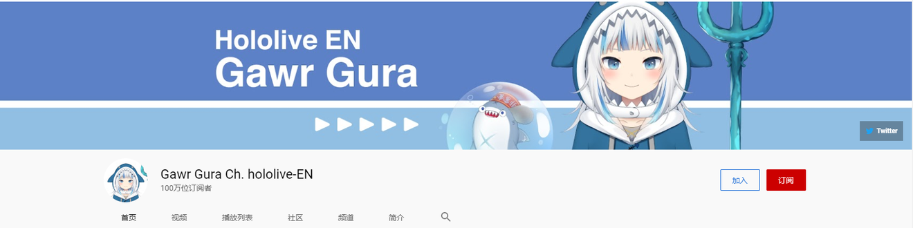
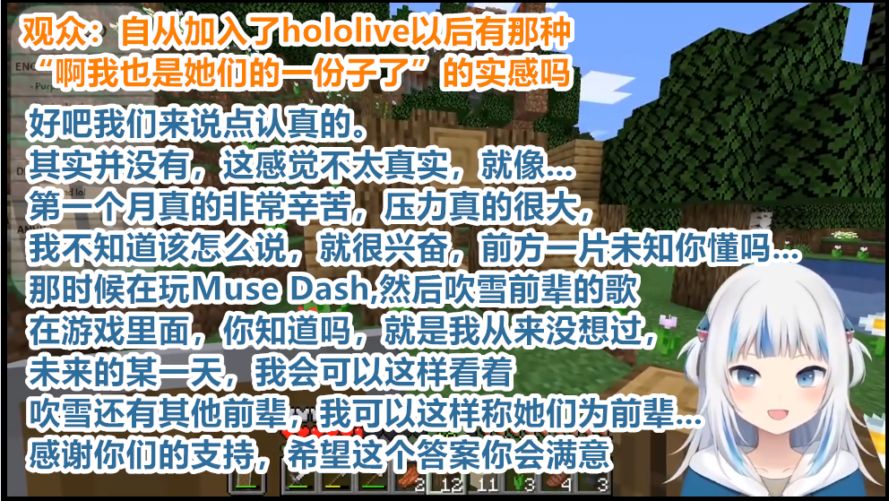
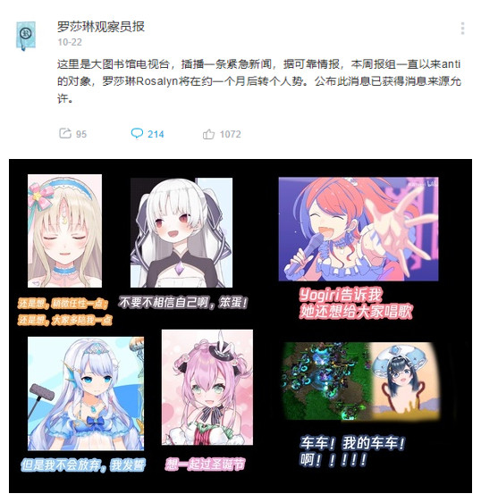

# 01

**hololive第一金盾:噶呜古拉**

当日，HoloEN所属虚拟主播噶呜古拉，达成油管100万订阅数，成为Hololive第一位金盾1主播。

噶呜古拉其前世2已有90余万粉丝，在加入hololiveEN转生噶呜古拉后靠着天生优势与个人能力，在短短一个多月中后发先至，超越桐生可可、白上吹雪、戌神沁音等人成为第一金盾，令人叹为观止。

而其本人也对一个月的飞速涨粉感觉不真实（其前世经营了3年左右才达成近百万订阅）。结合噶呜古拉本身的自闭直播风格、holo本部的艰难转型以及holoEN与holo本部的联动困难情况，让人不禁在想HoloEN与holo本部到底是谁成就了谁。但不可否认的是，在当下，HoloEN是hololive发展欧美市场的战略中至关重要的一环。

[相关链接：【熟肉】出道这一个月以來的真心话【噶呜・古拉】【HololiveEN】](https://www.bilibili.com/video/BV19t4y1Y7dj)

# 02

**华生·阿米莉亚国旗事件**

本日，HoloEN所属主播华生·阿米莉亚在直播中错误的使用了外国国旗，并在直播中出现了一定程度的口误，引发国外观众一波讨论，但未引起炎上。

此事让国内观众好奇的是，cover在前几日许诺的合规委员会是否真正成立，或是HoloEN和holo本社并不受同一班子的管理。不过值得肯定的是，华生·阿米莉亚的公关反应速度的确是要超过她的桐生可可前辈太多。

另外有意思的是，尚处于初级萌萌人阶段且未了解事件真正原因的部分欧美粉丝们将瞄头转向了我方。

[相关链接：再次踩雷？Hololive国旗事件的说明与辟谣](https://www.bilibili.com/read/cv8052827)

# 03

**“我是罗莎琳，我永远是罗莎琳。”**

本日，OG虚拟主播罗莎琳曝出消息，会带着“伙伴”和熟悉的“衣服”一起变成个人势。得知此条消息的粉丝们纷纷表示祝贺。

# 04

**#协会女装之战#**

10月21日晚，@天音彼方陶碗工厂 发布动态“以前的组员女装图”，随后，该动态被@不知火守林人协会 转发点赞。

次日，@不知火守林人协会 发布组员女装照动态，该照片主人宣称“拿去给别的协会施压”，随后@夜空梅露的樱桃汁工厂 发布组员女装照动态迎战，@伊那的黄瓜章鱼烧摊 迎战时打上话题标签，#协会女装大战#正式拉响。

随着话题热度的直线上升与其有趣的主题内容与极强的吸引力（？），该话题在B站迅速破圈，成为当日霸榜话题，大量圈外观众与组织纷纷参战，该话题热度在近期一直不减，截至11.07已有3500万浏览、3.3万讨论与3.6万订阅。

同时该话题也弄出一些有趣的误会，比如[【B限剪辑/熟肉】当鹿乃得知想进入字幕组要先穿女装](https://www.bilibili.com/video/BV1Ay4y187xG)

# 备注

1. 油管会给10万订阅的频道主颁发银色纪念奖牌，给100万订阅的频道主颁发金色纪念奖牌。B站的银色、金色小电视也是仿照此事而为。

2. 指在成为噶呜古拉之前的另一个Vtb身份。

3. 编者在转载文章时，考虑到与事件中心Hololive的相关性，刻意调换了顺序。事件04原顺序为01。