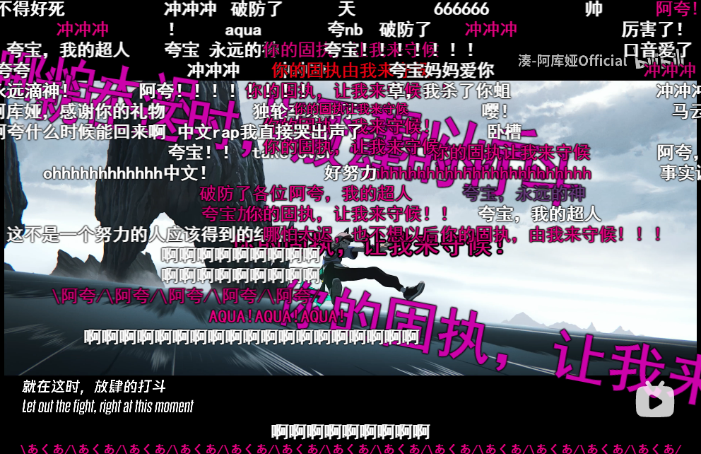
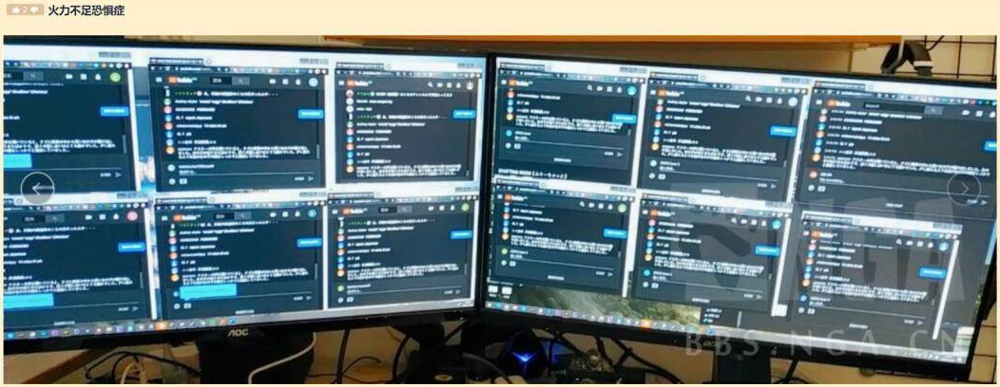
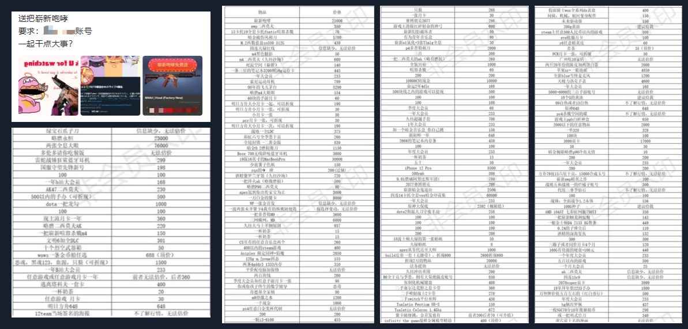
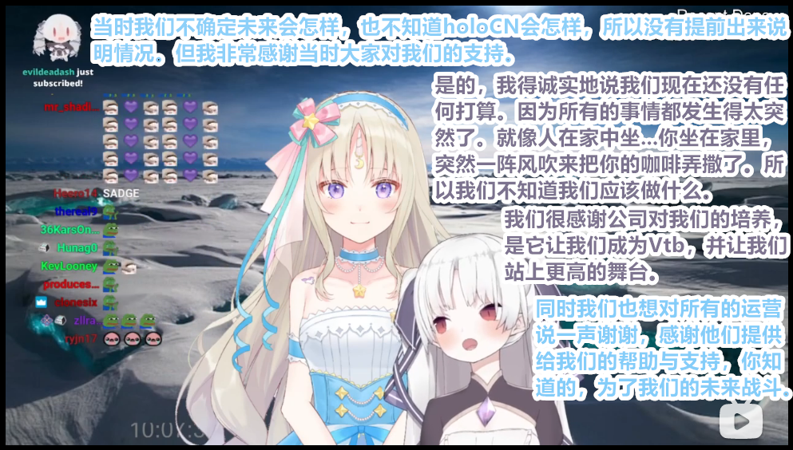
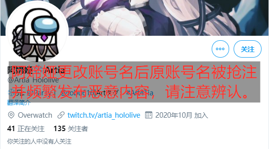

# 01 

**湊阿库娅《所向无前》发布**0

凑-阿库娅字幕组于本日零时许发布Take Over的高清版，数小时后发布For The Win的高清版。

此前，群众纷纷猜测其有与英雄联盟S10的工商合作，而实际情况不得而知。

由于发布的视频中有诸多英雄联盟官方素材，S10工商合作实锤。同时这也确认了工商本身告吹。

此首歌曲发布之后引起B站Vtb圈大轰动，holo圈相关动态均被此曲刷屏，经UP观测，除视频发布之初外，全天中该视频最低同时在线观看人数为凌晨4点的2800人，白天时间段平均一万人左右，晚间更是达到一万五左右。该视频全天处于B站首页推荐，在本日内即达到全站排行榜第二，后续升至全站热度榜一。

相关链接：[【湊-阿库娅】Take Over - 所向无前](https://www.bilibili.com/video/BV1vT4y1F7oo)

值得注意的是，该视频片源使用的是无缩水的4K画质，此种视频发布限制条件很高，联想到本次S10被B站独家承包的官方背景，该视频被认为是在B站管理层的首肯或授意之下发布的，此事涉及B站Vtb圈运营策略，水平有限，不作讨论。

大批Crew1及其他Hololive破防，乐子人群体再次壮大。

视湊阿库娅为偶像并以此为契机进入hololive的OG主播希薇娅留言“别的我不说了，大家，一键三连拜托了”，得到大量点赞。随后希薇娅与阿媂娅更是在各自的推特上对湊阿库娅进行声援，此举也极有可能招来国外黑粉对她们的攻击。

众多粉丝在伤心之时，也加深了对桐生可可的恨意，被视频引流而至了解了部分经过之后的观众与大部分粉丝达成了“冲蝗”的共识，群情激奋之下，当晚桐生可可与樱巫女的两个小时Ark联动直播遭到了全程高强度刷屏覆盖，详见下条。

# 02 

**“Ark联动”与虚拟齐格飞事件**0

晚上九点，桐生可可开启了与樱巫女的ARK2联动。此次联动属于有观众参加的联动，两人将参观对观众开放的ARK服务器。

乐子人在近段时间的发展之中，通过有能人士的支持，以某海鲜平台直播自动发信器为基础，开发出了具有国际化特色的“独轮车”科技体系，该体系在实际使用中逐渐具备了便携化、自动化、定时化等特点，通过《冲蝗指南》等途径传播到了大量观众手中。

此次联动桐生可可没有开放自己的直播间，而是在樱巫女的直播间进行联动。

值得注意的是，樱巫女直播间中，桐生可可意外地活跃，颇有喧宾夺主之势。无论是进入游戏之前还是游戏中，桐生可可都比樱巫女更为醒目。

**不看频道，请问这是谁的直播间？**

另外，由于本次直播的Ark是参观粉丝服务器，服务器的地址信息被乐子人获取。最终个别乐子人顶着网络延迟成功潜伏进入服务器内，并两次成功挑衅桐生可可。

值得一提的是第一次，在说完MIKO SUKI后，两人正在笑着回复的时候，立刻接上了一句coco毕业，颇有讽刺感。

**Miko suki, 可可毕业**

**第二次桐生可可毕业**

该事随后在国内各平台迅速传播，大量观众给予称赞，将该名玩家冠以“虚拟齐格飞”3的头衔。

相关链接：[【剪辑熟肉】冲虫勇士 虚拟齐格飞](https://www.bilibili.com/video/BV19a4y1W7L7)

大量观众都在寻找该名玩家的踪迹，然后错误地认为当时在B站直播的另一名主播是“虚拟齐格飞”，纷纷给予其称赞与打赏，该直播间一度登上当前直播排行榜。众观众希望主播能再次对桐生可可进行直球辱骂，但由于网络延迟过高的问题，直到桐生可可下播后仍未成功，并且该直播随后被超管关闭。

随后该主播在其动态解释到，他也是成功进入服务器的一员，但由于网络问题，没能达成其目的，但今后会继续努力，近期准备常驻此服务器。

# 03

**悬赏事件**

本日B站一位观众发布动态，动态内容表示以一把CSGO枪械皮肤作为悬赏，对某目标进行网络攻防演练，该动态迅速得到大量转发，站内许多网络安全爱好者们对此活动都表示出极大兴趣，也纷纷在此动态下回复添加悬赏。后经某观众统计，悬赏暂估价累计已达数十万元。

# 04

**希薇娅与阿媂娅宣布退出hololive**

本日晚间，希薇娅前往阿媂娅的twitch频道进行共同直播，向国外的粉丝们解释了一下近期发生的事情。同时两名主播宣布正在进行退出holoCN的程序，之后的计划尚未明确，但仍感谢所有粉丝的支持。

值得注意的是，阿媂娅在欧美市场颇具人气，加上声援湊阿库娅一事，此番操作预计将引来大批国外黑粉攻击。

相关链接：[【10.26 Artia与Civia在 twitch 关于退出Hololive的声明直播】](https://www.bilibili.com/video/BV1Wz4y1o7ZB)

# 05

**阿媂娅更改账户名相关**

阿媂娅宣布退出holoCN后，将推特原账户名@Artia_hololive更改为@Artia_OW，随后@Artia_hololive被不明人士抢注，并开始冒充阿媂娅发表、转推大量危险政治言论。

截至编者更新时，此[冒充账号](https://twitter.com/artia_hololive)仍处于活动状态。

**杂碎**

# 备注

0. 本条包含编者的信息，同时与转载合并。
1. Crew：凑-阿库娅粉丝的爱称。
2. ARK：这是一款于2017年发布的动作冒险生存游戏，中文译名《方舟：进化生存》。允许单人或者多人游戏。
3.  齐格飞(Siegfried、ジークフリート)，是中世纪德国英雄史诗中的屠龙者。史诗《尼伯龙根之歌》、歌剧《尼伯龙根的指环》等作品的主人公。