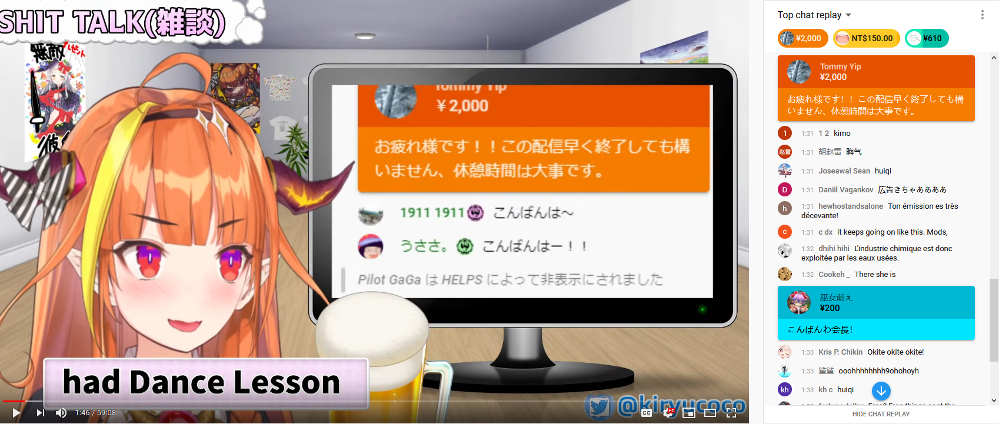
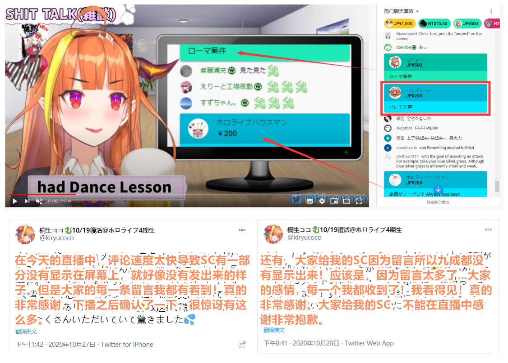
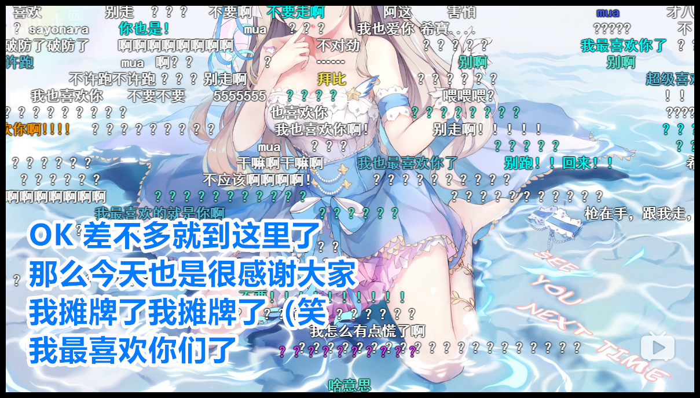

# 01 

**桐生可可开启插件过滤非会员发言**

深受“乐子人”们刷屏侵扰的外国粉丝们一直很头痛无法正常使用直播间聊天栏，随后一款可以只显示会员发言与SC的插件在他们之中流传开来。而复播以来一直苦于无法展现聊天栏的桐生可可在今日也使用了该插件，并将其用于杂谈直播中，希望以这种方式提高与粉丝的有效互动。

今晚，当桐生可可按照直播预报开启直播时，众多乐子人发现桐生可可使用了Chrome插件过滤聊天室发言，并读了一部分SC。

值得注意的是，其并没有全程展示经过过滤聊天室的内容。

**在SC下方的非会员发言并未显示**

**用GIF遮挡聊天显示**

虽然这对于路人的观看体验并无改善，但仍是核心粉丝的一针强心剂。但可能是由于插件不完善或评论栏刷屏过快，直播屏幕中捕捉到的会员发言与SC内容总是有缺失，下播后的桐生可可也是发现了这一点并在推特上向粉丝们道歉。

在直播中，桐生可可提到要与姬森璐娜进行联动。

# 02 

**HoloCN事件疑似反转**

本日午间，OG的几位主播同时发布动态，内容均为省略号“。。。”，黑桃影在直播中突然沉默，阿媂娅之后也将签名改成问号。

伴随着从不明来源流出的小道消息，诸如“CN运营只是单方面口头答应OG解约”、“只有10月不抽成一事有书面约定”、“乐府1插手了要和B站鱼死网破”，“B站和Cover谈不拢了，Cover不放人”等越传越广，一时间风声鹤唳。

随后，OG主播希薇娅突然直播预告，声称“有礼物要给大家看看”随即开启直播。直播间名称开始为“别打钱”，后来更名为“安静听就好了”，随后在直播中播放了一些音声，也展示了生日新衣装。

直播间的观众们都认定这是原计划在希薇娅生日兼一周年企划时的相关内容，推测出希薇娅可能无法再顺利举行生日兼一周年庆祝活动了，也确定OG方面真的出了大事。

但由于全都是小道消息且无官方出面说明的情况下，最后大家达成了一定程度的共识如下：

1. 消息来源复杂，唯一确定的是cover反悔，在官方正式出面前拒信任何小道消息。

2. 不要带节奏，不要分散火力，“冲蝗”的力量都不够，没有力量冲别人。

3. 不需要去团结外网OG粉丝，立场有差异，操作困难，容易弄巧成拙。

编者注：Cover已经于2020-11-12发出公告，确认HoloCN的毕业，然而，似乎由于某些问题，黑桃影的名字未在其中。详见[这里](../20201112/README.md#01)。

# 备注

1. 乐府，国V魔女公会老板，因行事风格与经营方针被观众颇为诟病。