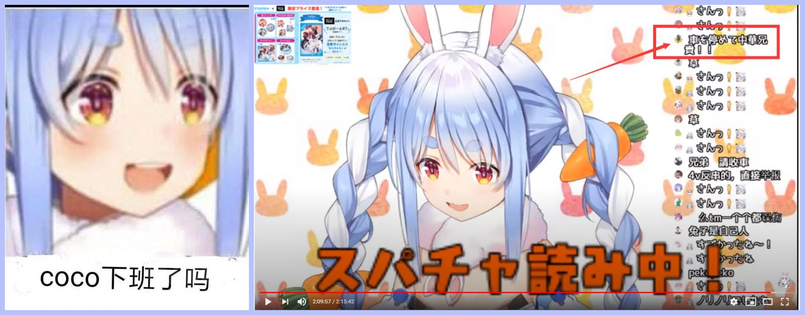
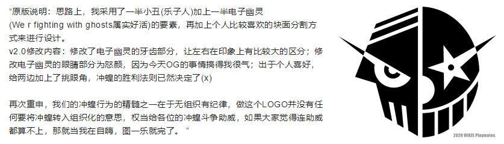
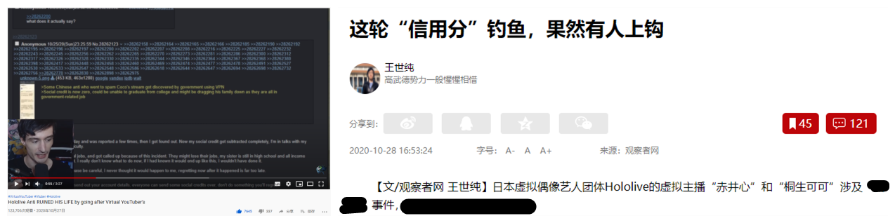

# 01 

**兔田佩克拉误伤事件**1

今日，由于部分观众对于“自动化放置型独轮车”的使用不熟练，在桐生可可下播之后忘记关闭“独轮车”，使得其网络页面被油管平台的自动推荐功能转推到同社主播，兔田佩克拉的直播间中，当时兔田佩克拉正在进行直播末尾的SC感谢环节。直播间突然涌进一小批“独轮车”对评论栏刷起了桐生可可相关的垃圾信息。

兔田佩克拉随后也反应过来，但没有对此作出其他动作，仍旧有条不紊地进行SC感谢，倒是评论栏中的粉丝们开始骚乱，有其他乐子人跑来喊“停车”的，有粉丝控诉举报“独轮车”的，还有不知道哪儿来的妄图转火佩克拉引发节奏的。

该事传至NGA平台，其中一条“中华兄贵们快停车”的日文评论被广为扩散。NGA乐子人针对此事件也创造了一条“哦，coco下班了吗”的兔田佩克拉相关梗。

# 02 

**乐子人的LOGO**

随着“乐子人”的活跃化，各类二创作品层出不穷。今日，随着之前提到的《冲蝗战报》转发，一则刊登在其上的粉丝自创“乐子人LOGO”开始流传开来，也开始成为“乐子人”的一个标志。

# 03

**信用分相关**

在本次炎上事件中，许多别有用心之人感觉是他们展现自我的一个机会，开始通过反串带节奏、窥视NGA论坛、翻译并抹黑相关内容转至国外平台等手段参与进来。

“信用分”是某些人用于抹黑我国创造的一个旧梗，后来被战略忽悠局活用。鉴于他们在本次事件中的活跃化，NGA老哥们也开始高频率地重新玩起了这个梗，随着事件热度上升，“信用分”一事也开始被欧美观众了解。

近日一名在油管平台拥有20万订阅的视频主便以“追堵Vtb的Hololive黑粉们毁了他们的人生”为题对部分观众进行评论与嘲讽。

看着还蛮有意思的。

相关链接：[【（熟肉）Hololive的Anti因为冲虫皇毁掉了自己的人生】](https://www.bilibili.com/video/BV1Na4y1s7v9)

# 备注

1. 编者注：兔田佩克拉误伤事件上移到01，乐子人Logo下移到02.