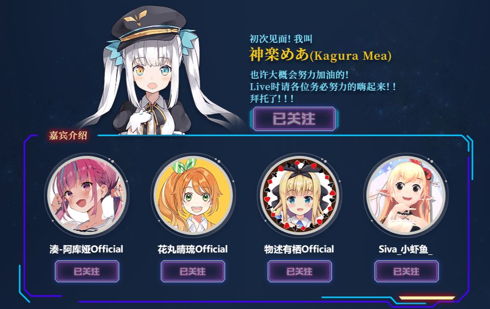

# 01

**“神楽Mea 1st Live ~Start~”嘉宾公布**

随着在B站拥有极高人气的个人势虚拟主播“神乐mea”的”神楽Mea 1st Live ~Start~”举办日临近，B站官方于本日公开了本次Live的出席嘉宾，其中，hololive所属的虚拟主播湊阿库娅赫然在列。

要注意的是，虽然本次Live的特邀嘉宾是按照BLS2019的排名结果产生的。但湊阿库娅若以当前的身份出席本次Live，观众们认定是绝对会让Cover获得收益且产生一定影响。

鉴于上述原因，包括湊阿库娅粉丝在内的大量观众在相关动态下开始反对湊阿库娅出席此次Live。

神乐mea与湊阿库娅这一对被称为“meaqua”的组合在国内Vtb圈具有大量拥趸，此次共同出演对“meaqua”及其粉丝来说具有重要意义。

而以“真性情、不做作”为特质，被粉丝称作“屑女人”的神乐mea在此时并未出面发声，许多观众也能感觉到此事正在酝酿着什么。

编者：此事也在NGA引起轩然大波，同时神乐魅娅本人的行为也有些迷惑。考虑到此事件与Hololive仅有些许关系，编者将暂时不采集这方面的资料。

**“向日葵的约定”还能实现吗？**