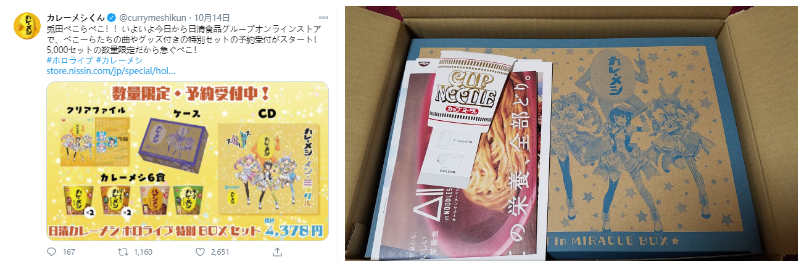
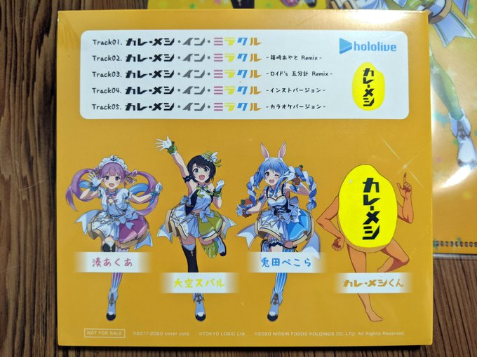

# 01

**日清联动CD solo曲炎上事件**

早些时日由hololive旗下三位虚拟主播与日清食品联动的日清咖喱系列于10月14日开始在网购平台贩售特殊限定套装，限量5000份，引发粉丝哄抢。

而逐渐收到套装的粉丝发现，其中最有价值的CD，其实际内容与宣传不符。由原先宣传的组合曲+各主播solo曲变为了只有组合曲，疑惑又愤怒的粉丝向日清客服发起投诉，日清的回复邮件中又将皮球踢给了Cover，Cover并未作出正面回应，但因购买人数问题，仅引发小规模炎上，至今结果未知。

根据编者的调查，套装中所包含的CD，符合日清的描述。而引发误会的是Hololive联动的Vtuber。

提及有Solo曲目的视频片段：

[Youtube视频](https://www.youtube.com/watch?v=-5TMTyV4JZA&feature=youtu.be&t=3071), [Bilibili切片](https://www.bilibili.com/video/BV1Pt4y1e7se/)

实际的CD曲目：

