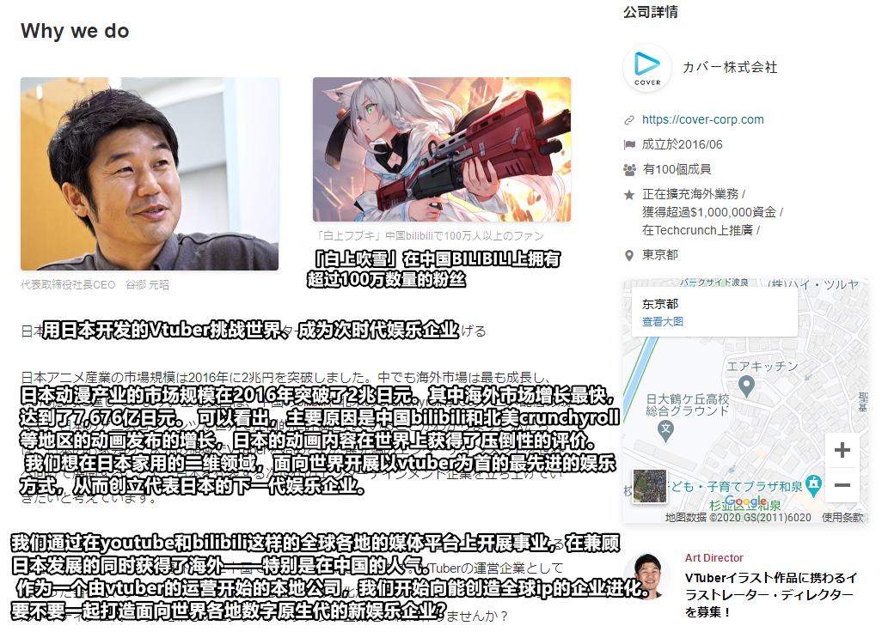
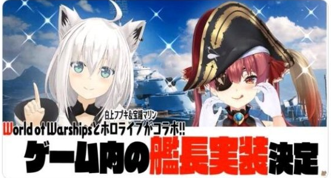
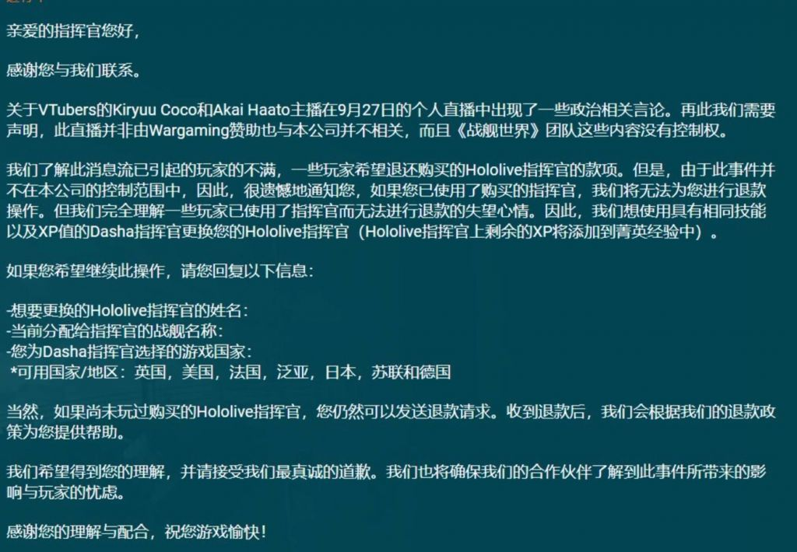
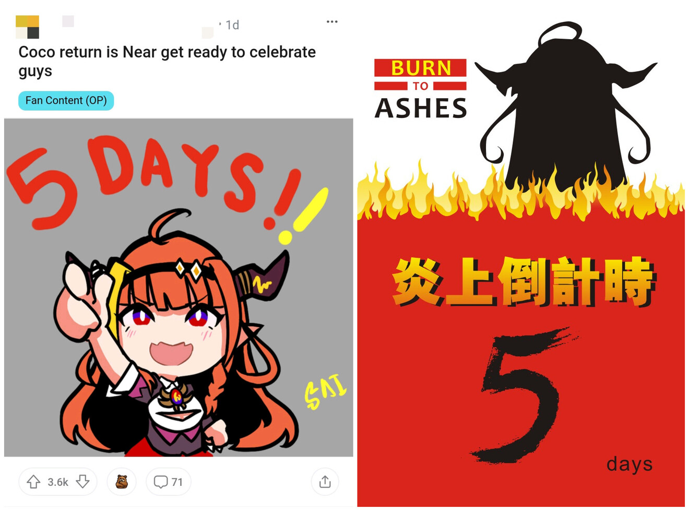

# 01 此次炎上事件发展至今，在日本5ch等论坛也引发诸多讨论，因“带节奏”、“污化环境”等手段在日本网络炎上事件中较为罕见，被部分日本网民感叹“原来还能这么炎上啊”。

注：日本炎上事件通常针对于公众人物个人的不当言行，而其最常见的方式为人肉信息、特定住址、信件骚扰等，极端情况下会产生恶性事件，近年日本因炎上事件导致人员伤亡的情况时有发生。

# 02 友人A转发cover公关招聘公告，部分国内观众表示不可思议，对cover作为圈内顶级公司其组织结构如何十分好奇。

**“离高考还剩5天，现在开始学来得及吗”**

# 03 上条中，有意思的是，虽处于中国炎上事件中，但在上述cover的招聘页面简介中，亦着重提到了hololive在中国取得的成就。

**《农夫与蛇》次世代Ver.**

# 04 近期，戌神沁音、不知火芙蕾雅、夜空梅露等主播均开启english only企划直播。hololive旗下主播的直播、推文等各种动态中英语向内容呈急剧上升态势，hololive业务重点方向已然明了。

- [戌神沁音【English only!】日本語を喋ったらダメなマリオ【Super Mario Bros.】](https://www.youtube.com/watch?v=_pid5tfoOy8)
- [不知火芙蕾雅【SUPER MARIO BROS.】だいたい英語縛りで頑張るマリオ！I'll do my best with English binding【ホロライブ/不知火フレア】](https://www.youtube.com/watch?v=TRDH5IaXNdE)
- 夜空梅露资料暂缺

# 05 在B站直播栏目-虚拟主播板块中，关于常暗永远及萝卜子的联动演唱会门票销售广告反复出现又消失于推荐位中，B站与hololive的业务关系仍扑朔迷离。

# 06 受事件影响，由白俄罗斯战争游戏研发公司Wargaming出品，空中网在中国大陆运营的某游戏中的hololive联动相关付费内容于近日开启了退款通道，该游戏部分用户对此纷纷好评。

- 退款声明引自[NGA](https://bbs.nga.cn/read.php?tid=23806032)。

# 07 近期，桐生可可推特账号与其中之人账号仍保持对简体中文内容用户的高强度拉黑中，其复播准备明显。同时，国内外观众对于桐生可可的直播都展现出十分的热情。

# 08 近期，不满足于传统视频与专栏形式的情绪表达，若干桐生可可相关的网络定制土味二创视频开始频繁出现在B站。