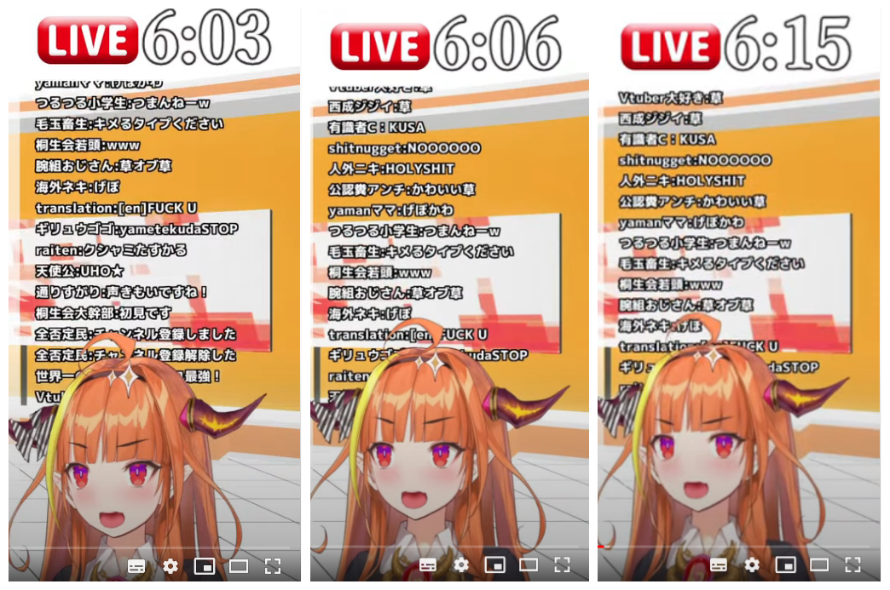
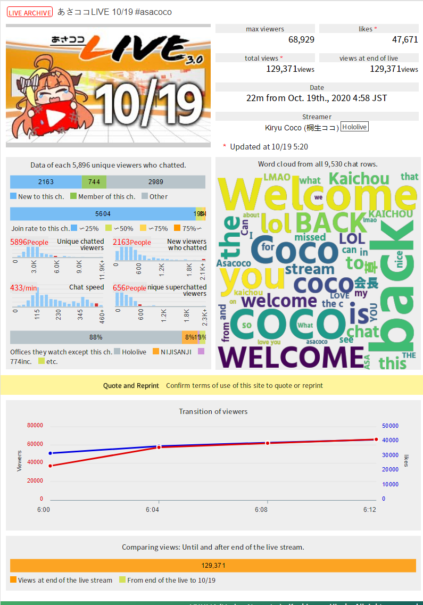

# 01 早安可可

发表回归声明后，桐生可可很快开启了10/19日的早安可可直播间。

大批乐子人、欧美MMR、日本人及其他地区人士纷纷涌入开播前直播间，聊天室陷入混战。

正式直播开始后，很快有人发现直播中的聊天栏是不断循环的字幕。也没有与聊天室的实时互动。

在20分钟的内容结束后，直播随即停止。

## 直播要点

- 赤井心与桐生可可的复播通知
- 白上吹雪、常暗永远、天音彼方、角卷绵芽、狮白牡丹、夏色祭等协助参演其早安可可小视频拍摄。
- 直播末尾放出图片声明“如果你爱这个视频就订阅，如果你恨它就给我滚粗”
   - 据笔者观察，此图片已经成为桐生可可视频结束常规ED。

## 其他要点

- 在hololive的直播历史中，该次直播率先采用了录播+虚假评论栏的形式。直播内容为事先录制好的内容再次播放，视频中的评论栏并未接入实时评论，采用自制评论反复刷新。

**能不能多做几页评论？？？**

- 主播与观众互动性基本为0，主播情绪平稳无波动（录播）。
- 直播间出现大量无关评论与骚扰内容刷屏，但遭到以日元为首的彩虹桥反击，总体上来说评论栏内容以欢迎主播归来为主，观众互相攻击为辅，斗争气息浓厚。
   - 在油管直播间，可以购买“超级聊天”发送评论，简称SC，根据消费金额不同，SC聊天框的颜色也会不一样。长时间、高密度、颜色多样的SC连发情况称为【彩虹桥】，对于直播间评论栏的风气导向有高度正向影响，代价是金钱消耗极大。

## 本次直播其他数据

# 02 复归直播

10月19日21时，桐生可可开启复归直播，直播名称“I’m back”,直播内容为杂谈+fanart鉴赏。

## 直播要点

- 直播间无评论栏，主播疑似开启了低速发言+延迟模式，主播与观众互动频率较低。
- 与前次直播相似，直播间出现大量无关评论与骚扰内容刷屏，但遭到以日元为首的彩虹桥*反击，总体上来说评论栏内容以欢迎主播归来为主，观众互相攻击为辅，斗争气息浓厚。
- 部分观众怀疑此次直播是经过精心安排的录播。

## 本次直播其他数据

