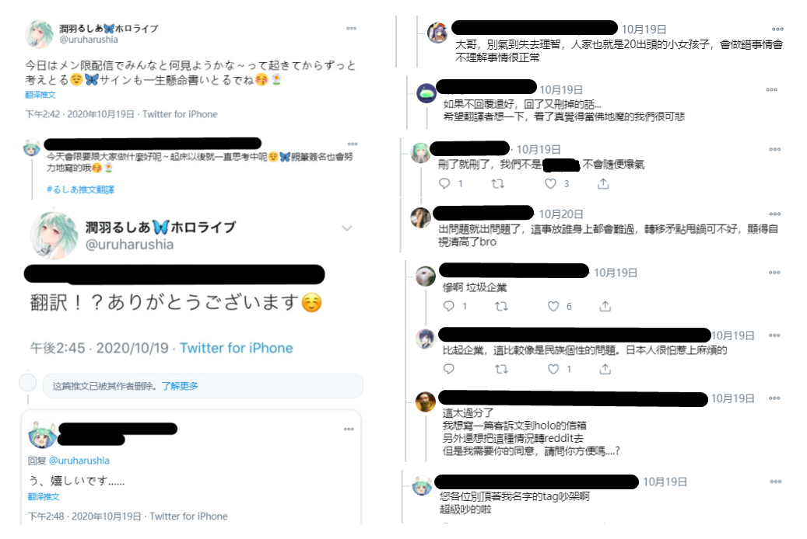
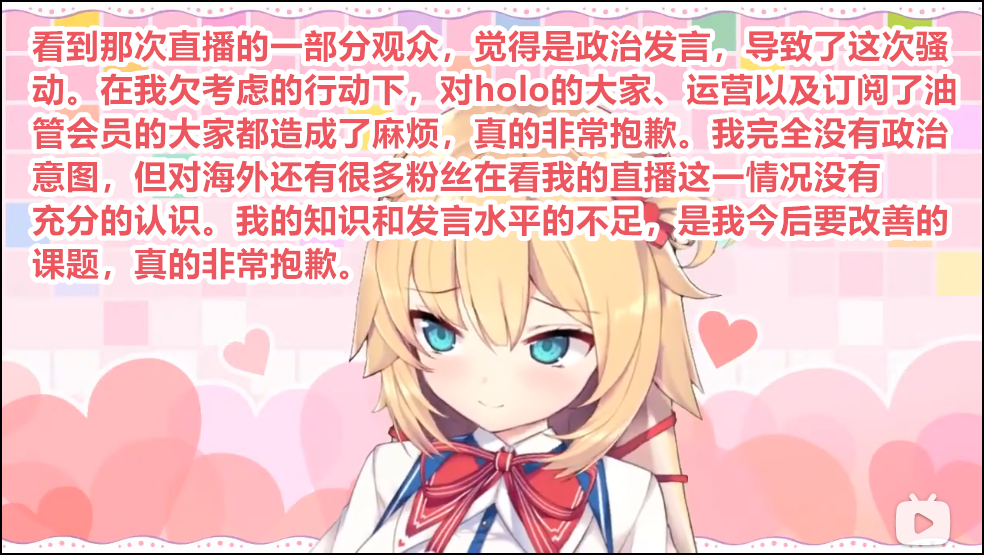
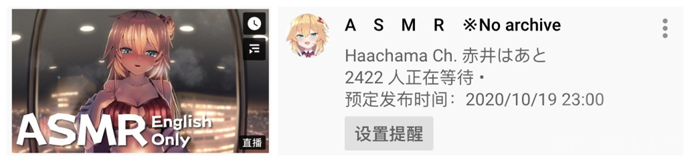

# 01

## 早安可可

发表回归声明后，桐生可可很快开启了10/19日的早安可可直播间。

大批乐子人、欧美MMR、日本人及其他地区人士纷纷涌入开播前直播间，聊天室陷入混战。

正式直播开始后，很快有人发现直播中的聊天栏是不断循环的字幕。也没有与聊天室的实时互动。

在20分钟的内容结束后，直播随即停止。

## 直播要点

- 赤井心与桐生可可的复播通知
- 白上吹雪、常暗永远、天音彼方、角卷绵芽、狮白牡丹、夏色祭等协助参演其早安可可小视频拍摄。
- 直播末尾放出图片声明“如果你爱这个视频就订阅，如果你恨它就给我滚粗”
   - 据笔者观察，此图片已经成为桐生可可视频结束常规ED。

## 其他要点

- 在hololive的直播历史中，该次直播率先采用了录播+虚假评论栏的形式。直播内容为事先录制好的内容再次播放，视频中的评论栏并未接入实时评论，采用自制评论反复刷新。

**能不能多做几页评论？？？**

- 主播与观众互动性基本为0，主播情绪平稳无波动（录播）。
- 直播间出现大量无关评论与骚扰内容刷屏，但遭到以日元为首的彩虹桥反击，总体上来说评论栏内容以欢迎主播归来为主，观众互相攻击为辅，斗争气息浓厚。
   - 在油管直播间，可以购买“超级聊天”发送评论，简称SC，根据消费金额不同，SC聊天框的颜色也会不一样。长时间、高密度、颜色多样的SC连发情况称为【彩虹桥】，对于直播间评论栏的风气导向有高度正向影响，代价是金钱消耗极大。

## 本次直播其他数据

# 02 

## 复归直播

10月19日21时，桐生可可开启复归直播，直播名称“I’m back”,直播内容为杂谈+fanart鉴赏。

## 直播要点

- 直播间无评论栏，主播疑似开启了低速发言+延迟模式，主播与观众互动频率较低。
- 与前次直播相似，直播间出现大量无关评论与骚扰内容刷屏，但遭到以日元为首的彩虹桥*反击，总体上来说评论栏内容以欢迎主播归来为主，观众互相攻击为辅，斗争气息浓厚。
- 部分观众怀疑此次直播是经过精心安排的录播。

## 本次直播其他数据

# 03

**润羽露西娅删除感谢回复 事件**

本日下午，润羽露西娅在发布一则日常推文后，感谢并回复了一位使用繁体中文翻译推文的粉丝，在该粉丝对其感到开心不已时，润羽露西娅似乎意识到了什么，随即删除了该条回复。

润羽露西娅对此番行为至今没有任何说明，在此不做阅读理解。该事对某地区粉丝造成了一定的打击，随后该粉丝的翻译推文及相关tag下发生了激烈的讨论。

# 04 

**赤井心复播实况**

经历三周的暂停活动之后，赤井心于晚间开启了复归直播，复归直播约持续了15分钟，直播中赤井心对事件起因进行了说明，并反省了自身的经验不足，对观众们进行了诚恳的道歉。

相关链接：[【熟肉】赤井心复归](https://www.bilibili.com/video/BV1za411A7s8)

与桐生可可的复归直播相比较，赤井心显得十分诚恳，也给予了许多新老粉丝以安慰。但令部分粉丝心情复杂的是，在结束了复归直播后的赤井心随即发布了稍后进行English Only ASMR直播的预告。

此次直播为赤井心暂停活动前搁置的直播计划，在复播后立即开始也属合理。而对此次英语向ASMR直播的时机选择，在此就不做阅读理解了。

