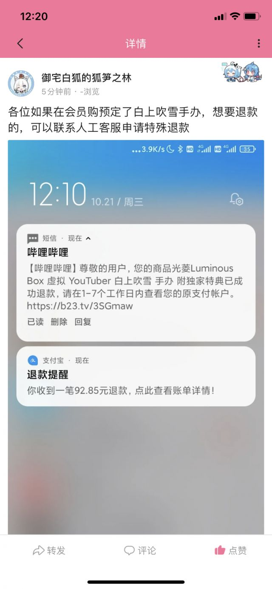
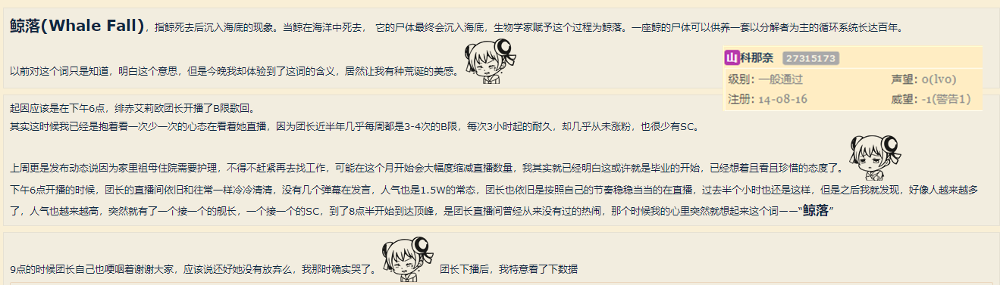
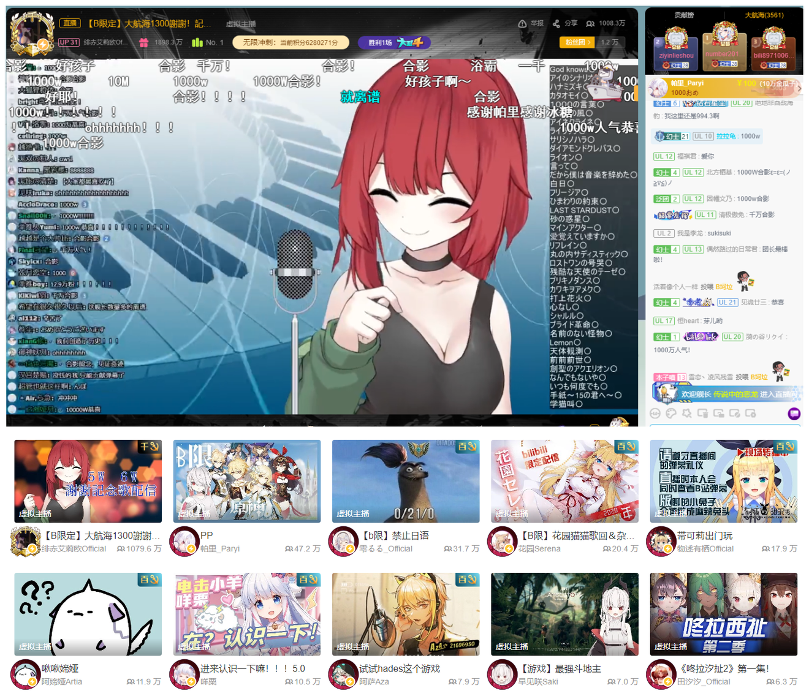
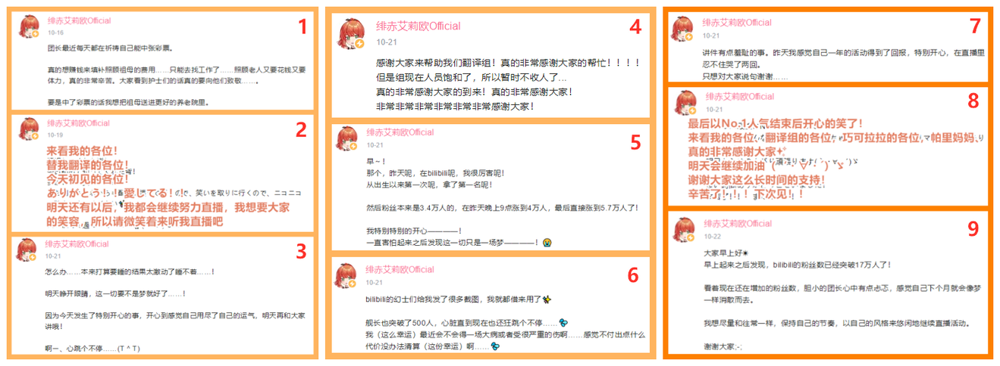
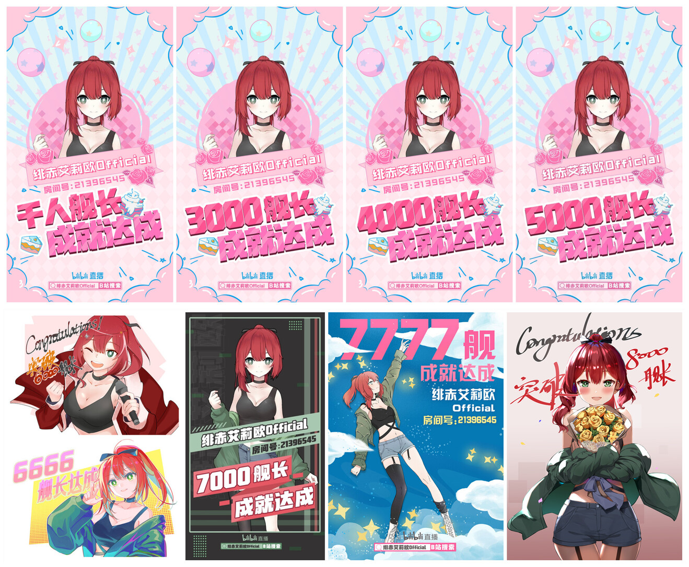

# 01 

白上吹雪手办预订退款

# 02 

桐生可可中之人直播

本次直播立即吸引了乐子人进入[其在mildom的直播间](https://www.mildom.com/10882672)开始攻击。

# 03 

桐生可可与赤井心联动，进行英文meme解析直播。

由于此次直播在桐生可可的频道进行，乐子人的攻击力度恢复，聊天室一片火海，陷入出警与出警出警的猜疑链。

# 04 

**《hololive死了》——瓶子君**

午间，B站百大UP主之一瓶子君152发布视频《hololive死了》，视频以hololive在中国市场的实质性死亡为主题对其进行了辛辣的讽刺。该视频短时间获得大量播放，成为本事件继各圈外官方平台报道之后的又一重大破圈因素，在B站内部引发大量关注，许多用户开始尝试了解此事。

但因瓶子君本人视频风格与Vtb圈内用语较多等原因，大量观众想“吃瓜”却无从下口，经部分圈内观众自发扩散，包括[引用来源](https://www.bilibili.com/read/cv8332795)在内的部分视频与专栏得到大量圈外播放与浏览。

相关链接：[《Hololive死了》](https://www.bilibili.com/video/BV1JV411y76W)

# 05

**樱巫女回归live炎上事件**

因身体原因住院许久的樱巫女于本日正式回归，并举办回归live直播，直播中演唱了偶像大师的《M@STERPIECE》一曲，引发偶像大师粉丝们的炎上1，登上推特趋势。

hololive曾因手游《偶像大师：闪耀色彩》的无授权收益化直播及不认真的直播态度与偶像大师粉丝们结下梁子，此次樱巫女的演唱听闻亦无授权*，且因《M@STERPIECE》在偶像大师系列中的特殊地位2，导致此次炎上异常激烈。

不由再次让人想吐槽hololive的企划制作与风险规避能力。

# 06

**“鲸落奇迹”：绯赤艾莉欧**

虚拟主播社团——巧可拉拉所属的虚拟主播绯赤艾莉欧，在油管与B站双向活动。虽然每周在B站直播三到四次，但人气依旧低迷，B站粉丝数约为3.5万，直播间人气值常年保持在1.5万左右3。本身人气不高的她因为家中奶奶生病需要人照顾且家庭经济情况紧张的关系，在10.16日发布的动态中透漏出近期可能需要去打工的意向，其主播生涯濒临毕业。

但随着hololive在B站的实质性死亡，众多Vtb观众们也逐渐将目光转向B站中的其他主播，受此影响，B站虚拟主播区板块从原本的“一超多强”格局开始向“百家争鸣”态势发展，包括绯赤艾莉欧在内的许多底边虚拟主播的人气也逐渐好转。

10.19日晚，绯赤艾莉欧的直播间首次达到了16万人气值，让主播与粉丝都感到十分惊喜。直播结束后，一则名为《holo在中国的死在今晚让我亲身体验了一次“鲸落”(内附安利》的帖子发布在NGA论坛Vtb板块中，其中对绯赤艾莉欧的近况描述引发了众多观众的兴趣与关注。

10.20日晚，绯赤艾莉欧4万粉丝纪念直播，由各处汇集而来的观众们对绯赤艾莉欧的直播能力与其被称为“虚拟泽城美雪”的歌力给予了肯定，绯赤艾莉欧在本场直播中达成了500舰长成就4。

值得一提的是，在短短时间内，绯赤艾莉欧官组也招收到了大量字幕组成员，规模几近饱和，官组也是急忙发布动态公告，表示字幕组人员饱和暂不收人。在后期的官组视频中，更是出现了上百人激光烤肉5的盛况。

10月21日午间，为纪念达成5万与6万粉丝数，绯赤艾莉欧开启8小时耐久歌回直播，从中午12时直播至晚间8时。直播期间大量观众涌入，打赏与礼物也水涨船高，在晚间黄金时段，B站官方也以“叔叔”的名义下场打赏，引发舰长与SC狂潮。

这场B站虚拟主播圈的狂欢一直持续到晚8点，绯赤艾莉欧下播前，以13.1万的当前粉丝数，达成了3600舰、1000万人气的成就，为B站**虚拟主播圈**历史最强记录6。

[相关链接：【绯红色的奇迹之夜】](https://www.bilibili.com/video/BV1RK411A7Si)

绯赤艾莉欧一夜封神，引发圈内极大讨论，“团长”这一称呼，在B站Vtb圈中也从默认银白发色的那位变成了酒红发色的这位。许多观众与粉丝在讨论中达成了一定共识：

1. 此次3600舰中含有大量针对hololive事件的报复性消费与情绪宣泄等因素在内；

2. 欲戴王冠，必承其重，希望绯赤艾莉欧能保持初心，不要被突如其来的人气冲昏了头脑；

3. 无论前方有什么隐患，都不会比之前更差了，感谢奇迹眷顾团长。

事后，有个别观众前往hololive相关推特下宣扬此事，但至今暂未引发严重影响。

在随后的日子里，绯赤艾莉欧开始高强度为巧可拉拉社内其他成员引流，也成功的让其同事们的人气得到了大量增长。B站虚拟直播板块的消费水平也呈肉眼可见的态势提升，绯赤艾莉欧的人气一直居高不下，众多观众、粉丝与其他人怀着不同的目光注视着绯赤艾莉欧的飞速成长。

截至11月7日7，绯赤艾莉欧已达成8000舰长，而她的故事也仍在继续……

**是报复性消费还是众人欲建奇观？是乘势而上还是登高跌重？但令人庆幸的是，总比奶奶没钱治病时要好多了**

# 备注

1. 鉴于偶像大师粉丝规模与hololive粉丝规模的比例，编者暂且将这次炎上定义为一般炎上事件。

2. 演唱此曲到底有无授权一事暂未查明。

3. 对不熟悉B站直播的朋友们简单说一下，人气值不等于观众人数，一个非常粗略的算法是由人气值除以20~30后可大致得出实际观众人数。不过这个算法在有大量礼物与打赏时将会产生极大误差。

4. 在此之前，500舰长是B站虚拟主播直播区的顶级主播才能达成的数字。

5. 指针对刚刚结束的直播立即开展视频译制工作，在短时间内发布熟肉的行为。

6. 据不完全统计，在这之前的B站直播记录中，最高舰长应该是zettaranc的5000舰，最高人气应该是LexBurner的1700万人气。

7. 转载文章作者所记录的时间。

