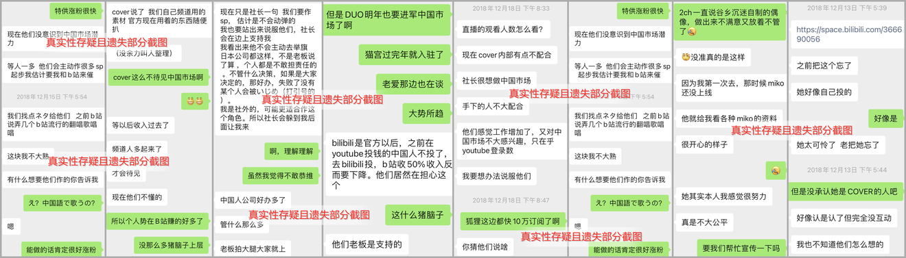
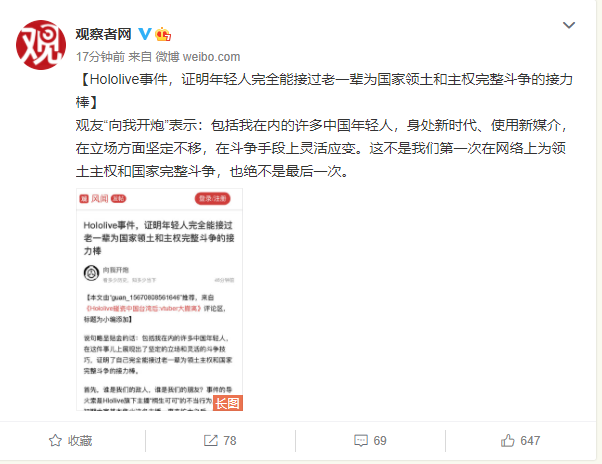

# 01

**“石头人事件”的风评波动**

近日，被圈内粉丝称作“石头人1事件”2的当事人之一“胃”，于近期再次出现，在其B站动态发布部分聊天记录截图，疑似是对holo现状的嘲笑与对B站Vtb圈扭曲生态结果的讽刺。

在其发布的动态中，粗略可总结部分含意如下：

1. 石的工作能力很强，当初若没有把他弄下去，holo在中国就不会落到这个下场。

2. 通过石的交流与观察，holo的个别vtb作风有问题，个别vtb能力不强，部分vtb对B站很上心。

经“胃”的这一次历史披露，“石”在工作能力方面的风评回升。

# 02

**观察者网微博相关**

近日，观察者网微博转发其平台上一篇关于本次事件的相关文章，强调“hololive事件证明年轻人完全能接过老一辈为国家领土和主权完整斗争的接力棒。”

# 备注

1. “石”为前hololive中国区总负责人，谷乡元昭的好友。

2. 关于“石头人事件”，已经包含在本项目之内。具体可参见[这里](https://github.com/hololiveEventCollection/hololive-720)。亦可搜索“Cover中国负责人石事件”。

