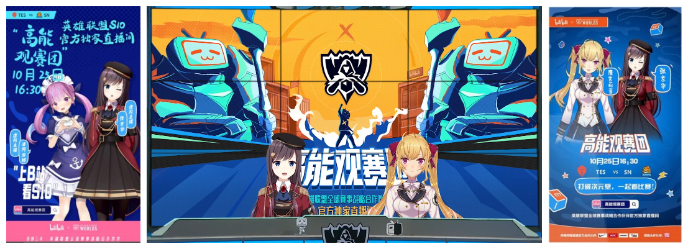

# 01 

**凑-阿库娅S10废案流出**

此次事件与次日的高清版Take Over放出，进一步加剧了矛盾的发展。

在『9.25桐生可可炎上事件』初期就有粉丝通过情报分析得出湊阿库娅可能有本次英雄联盟世界赛（即S10）的相关工商活动，随着事件的发展与更多情报的披露，这份猜测也愈加肯定。

本日下午，虚拟主播首次出现在S10比赛高能观赛团直播间中，主持人为屡次与B站有线下合作的overidea所属主播张京华，嘉宾为2434所属的鹰宫莉音。随着比赛的进行，B站与NGA论坛出现了名为“湊阿库娅S10高能观赛团废案图”与“湊阿库娅S10宣传曲泄露音源”等相关资料。

要说S10废案图伪造还较为简单，但泄露的音频文件中湊阿库娅较高辨识度的声音让其真实性得到大大提高，其中主播并不标准的中文说唱部分更是让粉丝们更加心情复杂，在众多粉丝达成的共识之中，作为以“傻气”、“丈育”等特色闻名的虚拟主播湊阿库娅要演唱此曲还是略有难度的。

之后，粉丝们更是联想到前几日湊阿库娅在油管直播时提到的未发布英语曲目，一时间更为心疼。1

相关链接：[【切片熟】为了英语歌好好努力的夸](https://www.bilibili.com/video/BV1si4y1772d)

# 02 

**桐生可可直播、乐子人及“战报”相关**

自桐生可可复播以来，以“乐子人”2为名的观众们一直对其直播间进行点踩、刷屏等骚扰行动，意图使用此种手段来影响桐生可可的直播效果，提前结束其直播生涯。

虽然网络连接的原因限制了极大部分“乐子人”的行动，但由于国内外网络直播环境的差异，使得“乐子人”的“攻击”意外取得了一定的成果。在推特tag已经混乱多日的情况下，桐生可可的每次直播都出现了不少“乐子人”的身影，他们通过使用各种语言、各种身份、各种工具给直播间的普通观众与主播本人带来了极大的困扰。

“乐子人”，顾名思义，“乐子人”们具有在混乱中发掘并制造乐子的能力，随着“战斗”的进行，大量的有趣言论、故事及相关二创作品开始在各平台涌现，也有部分UP主开始对桐生可可直播间的“战况”进行实时播报与战后复盘。

随着找乐子行为的越发普及，NGA论坛中，一份名为《冲蝗战报》的汇集各方乐子动态的网络期刊开始发布，广受好评，随着规模扩大，变得越发正规，传播甚广，成为乐子人的标志活动之一。

# 03 

**HoloCN正式宣布脱离，OG朵莉丝宣布将以个人势身份活动**

在中国运营的努力下，HoloCN宣布脱离Cover，将转为个人势或独立企业势继续运营，同时带走原有的虚拟形象。

本日，OG主播朵莉丝发布动态“有两个重大消息要公布”。晚间开启直播，直播中宣布：

1. 之后将以个人势的身份继续活动；

2. 10月份的收益将用以制作3D化功能。

[**然而，这是不可能的**](../20201027/README.md#02)

# 备注

1. 湊阿库娅是hololive所属对B站上心的主播中影响力最大的一位，曾被本土黑粉指责其“媚中”。

2. 编者：原作者似乎忘记了之前解释过“乐子人”和“恶堕乐子人”（此事件中受到打击的粉丝）。当然，由于事件扩大化，“恶堕乐子人”也在传播的过程中变为了“乐子人”。编者删去了原文中的注释。