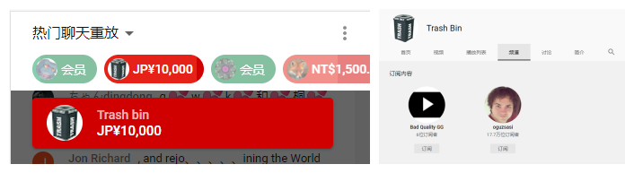

# 01

**桐生可可疑似购买SC**

本日，在NGA老哥们的观察下，发现桐生可可的直播间中存在有若干无内容高金额SC，且部分空白SC的打赏者曾多次出现在桐生可可之前的直播之中，随即他们便开始追踪分析这部分用户，发现了不少奇怪的现象。

比如说下图这位名为“垃圾箱”的用户给桐生可可打了10000日元SC，其个人主页中没有活跃动态迹象，甚至订阅的频道里也未关注1桐生可可。

NGA老哥们推测桐生可可有购买SC用于打赏自己的可能存在。

# 备注

1. Youtube用户可以选择性公开自己订阅的频道，故存疑。