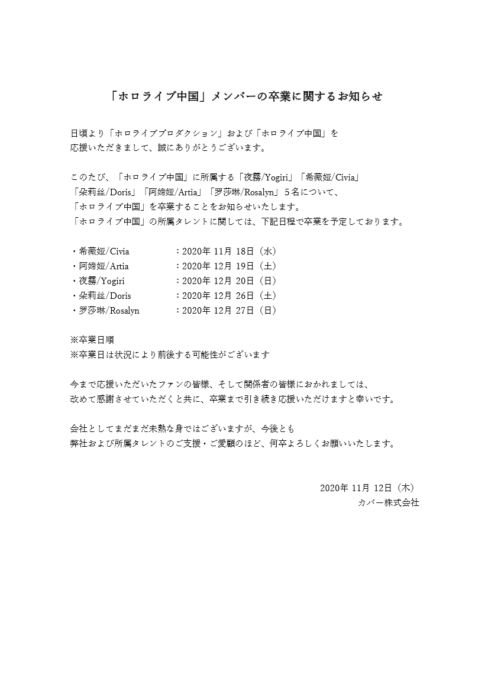
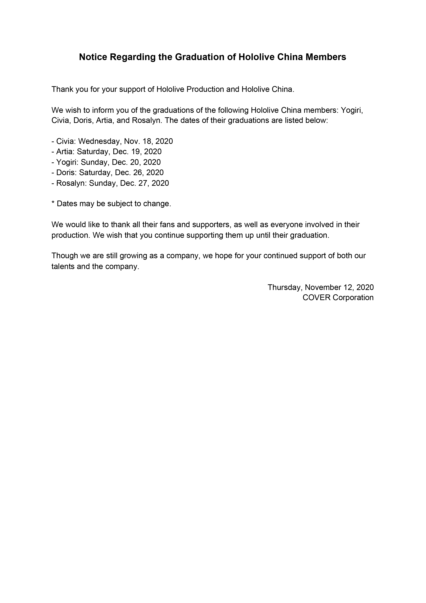
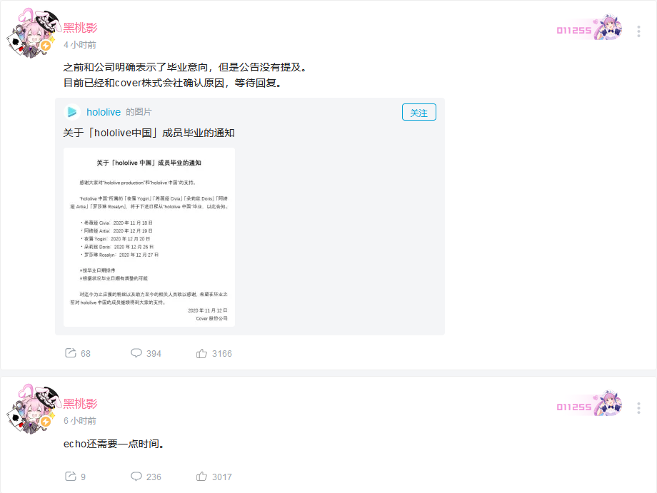
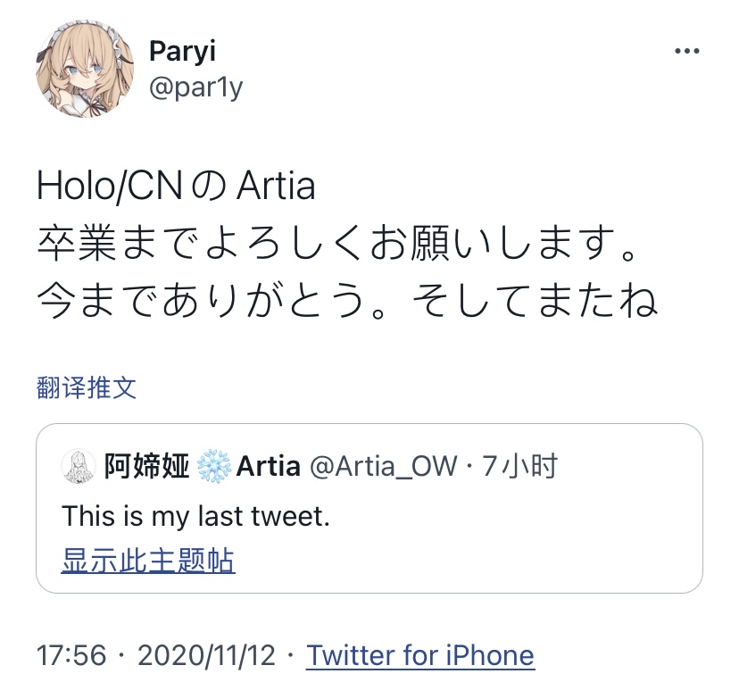
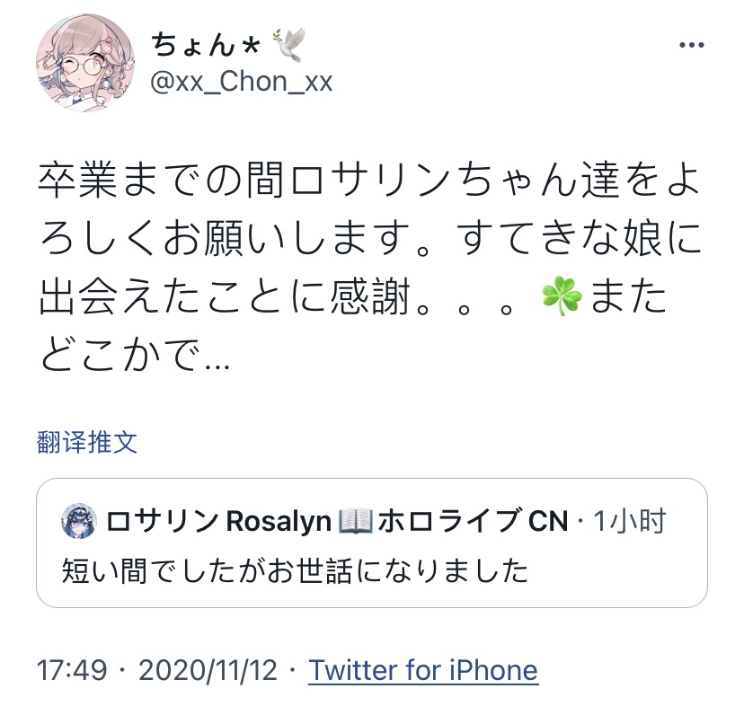
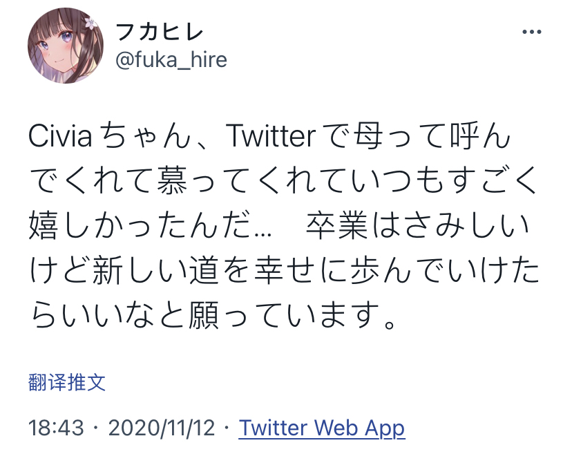
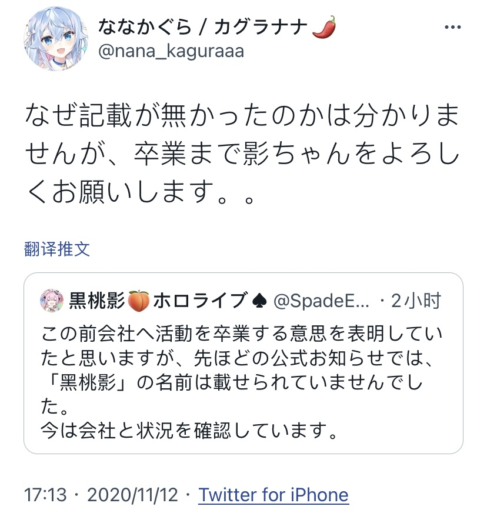
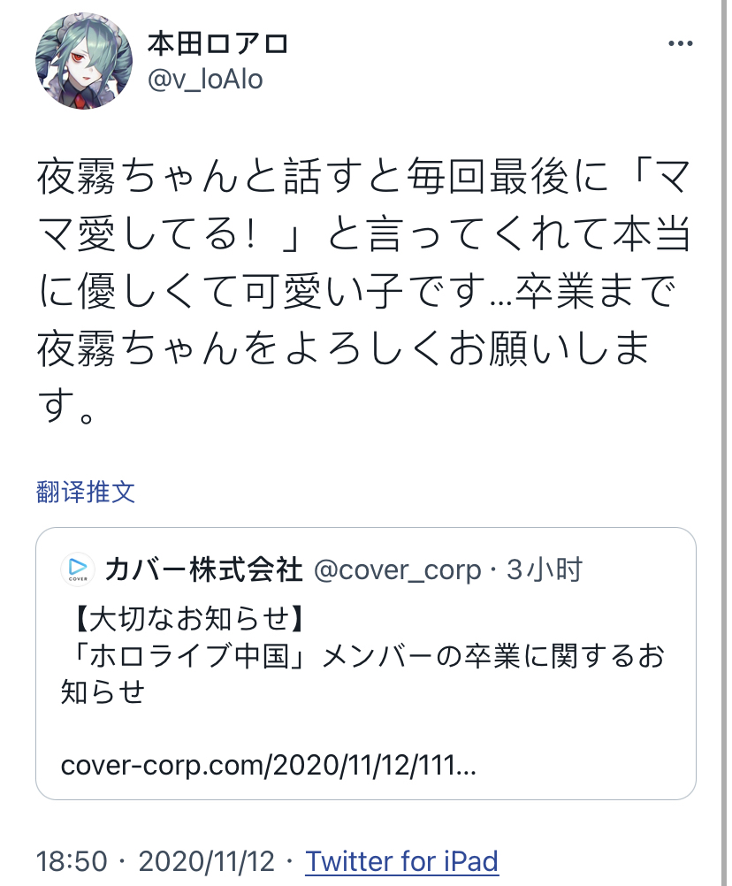

# 01

今日， Cover公司于[官方网站](https://cover-corp.com/2020/11/12/1112/)、[Bilibili](https://t.bilibili.com/456677790911251859)及[Twitter](https://twitter.com/hololive_En/status/1326807285566382080)同步发布HoloCN成员毕业公告。

**中文公告**

**日文公告**

然而，似乎由于Cover的问题，黑桃影的名字并未在公告中出现。

黑桃影本人已于Bilibili发表[动态](https://t.bilibili.com/456684731580523146)，表示已经就此事联系Cover。

**黑桃影Bilibili动态**

## 画师们临别赠言

帕里：

毕业之前还要相互关照。一直以来非常感谢。以后再见。

蘑菇妈(ちょん)：

在毕业前的这段时间里，罗莎琳酱这几个人就拜托大家了。感谢自己遇到了这么出色的女儿。愿之后还能再次相遇

蘑菇人的回推：相处时间不久，但承蒙照顾了。

希宝妈(フカヒレ)：

希薇娅酱，在推特上一直喊我妈妈，敬慕我，这让我每次都非常开心。毕业是件很悲伤的事，不过祝愿你能够在新的道路上幸福地走下去。

狗妈：

转载了echo发的推特。

虽然不太清楚公告上为什么没有记载桃子的情况，但是直到毕业之前，影酱(指echo)就拜托大家了。

夜宝妈(本田ロアロ)：

每次和夜雾酱聊天，在最后一定会对我说'妈妈我爱你！'。真的是温柔又可爱的孩子...在毕业前的这段时间里，夜雾酱就拜托大家了。