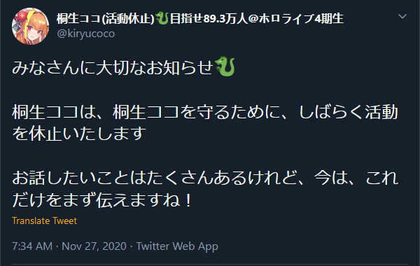
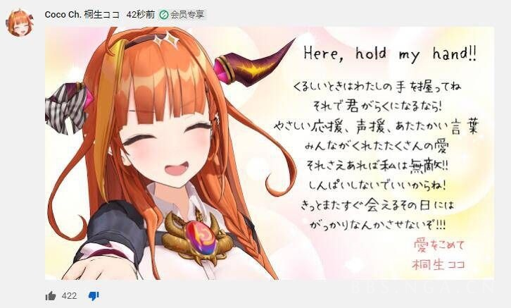
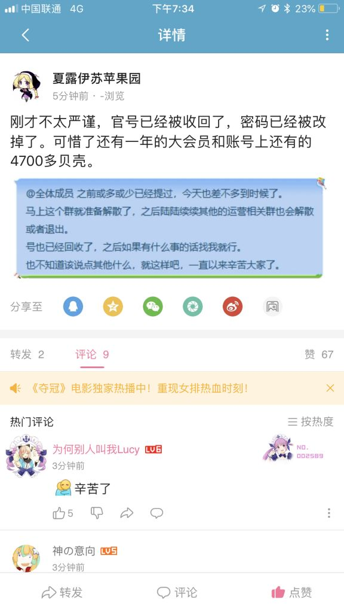
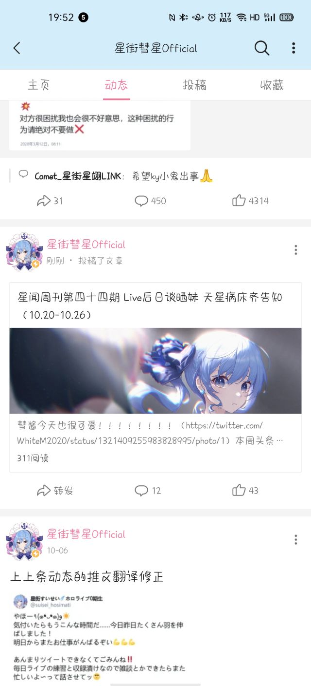

# 01

**桐生可可活动休止**

来源: [Twitter](https://twitter.com/kiryucoco/status/1332316912932560899)

细节未知，无法判断是Cover的决定还是本人的决定。

随后桐生可可发出一条会员限定的消息。

取每句话的首个假名，变成くそやみそしき（クソ闇組織）。

这种藏头诗的解读，有人认为是Cover强迫其暂停直播。

# 02

**Hololive运营相关群将陆续解散，官号陆续回收**

来源：[NGA](https://bbs.nga.cn/read.php?tid=24370790)

据AKI组转生的苹果园[B站动态](https://t.bilibili.com/462302334056493539)，此消息得到确认

# 03

**Cover公司获得SEGA作品授权**

来源：[Cover官网](https://cover-corp.com/2020/11/27/1126/)

此新闻代表Cover之前由于版权原因隐藏的一部分视频得以解禁。尚不明确此消息对Cover的影响。

# 04

**星街彗星字幕组短暂放出十月底周刊**

此事疑为运营回收账号中的误操作，三分钟后删除。

来源：[NGA](https://bbs.nga.cn/read.php?tid=24371242)

