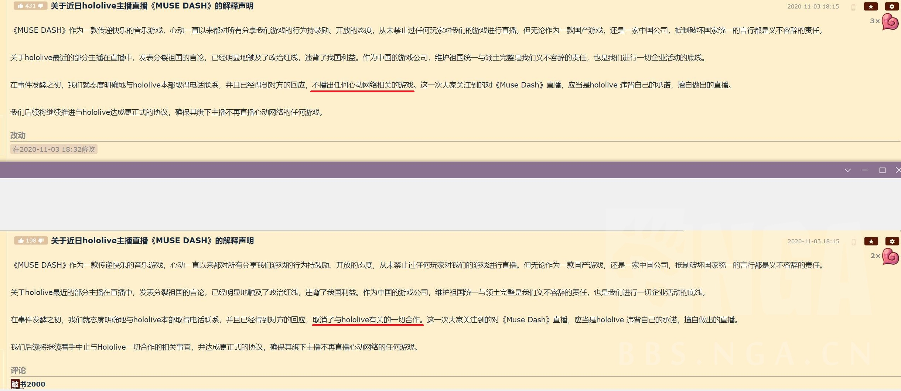
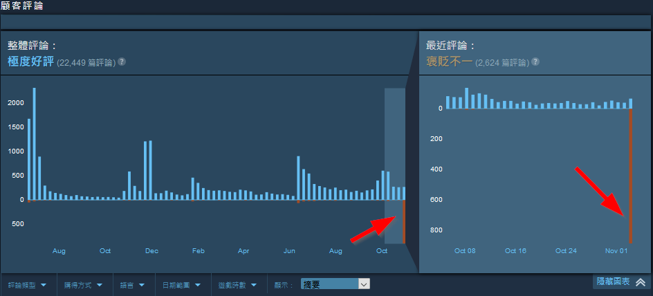
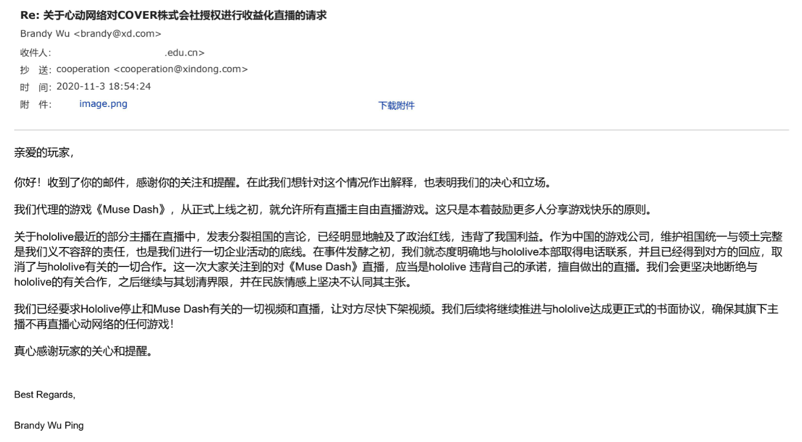

# 01

Muse Dash 授权事件

本日，赤井心于本人的频道直播由心动网络发行的Muse Dash([视频已隐藏](https://www.youtube.com/watch?v=qPWbEYTRnvs))。

此行为再次引起风波，因其视频下注明已经获得心动网络授权。

此后，心动网络在NGA的账号发布声明，称其已经联系Cover，取消了与Hololive的一切合作。此行为是Hololive方的独断。

然而，此声明在发表后经过编辑，对比图如下：

**注意红线标记**

同时，Steam上的Muse Dash页面开始涌现大量差评。

**近日大量差评**

有NGA网友给心动网络去信，得到以下答复：

## 不确定信息

- 有NGA网友发布疑似心动网络内部的聊天记录：[记录1](img-xindong-internal-chat-01.jpg)，[记录2](img-xindong-internal-chat-02.jpg)。

- 此公告楼曾短暂隐藏，删除了在楼中一人的发言记录：[部分记录1](img-xindong-hide-post-01.jpg)，[部分记录2](img-xindong-hide-post-02.jpg)。