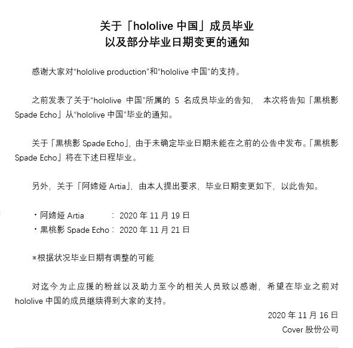

# 01

Cover于今日于[官方网站](https://cover-corp.com/2020/11/16/1116/)，[Twitter](https://twitter.com/hololive_En/status/1328280551975911424)和[Bilibili](https://t.bilibili.com/458197775542602477)发布了HoloCN毕业信息的更新公告。HoloCN所属的黑桃影将于11月21日毕业，阿媂娅将于11月19日毕业。

日文及英文公告的毕业日期在发布时有误，11月21日标为周日，实际为周六。

**中文公告**

**日文公告**

**英文公告**

# 02

Cover董事长Yagoo于本日同步发布一篇与HoloCN毕业有关的[文章](https://note.com/tanigo/n/n8dc4df1f6001)。

本地备份[见此](yagoo-note.md)。