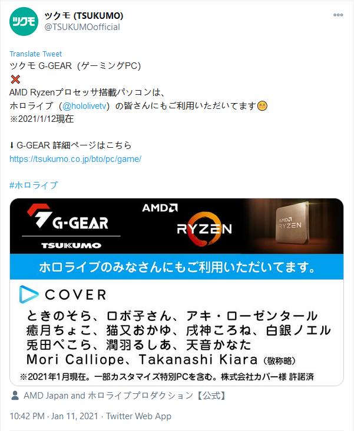
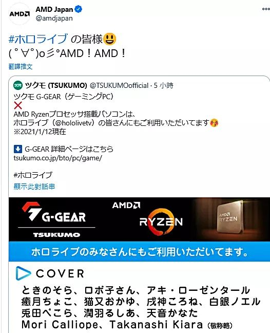

# 01

**日本AMD推特账号删除涉及Hololive的推文**

本日，一家日本的PC配件代理商，Tsukumo发出了[一条工商推文](https://twitter.com/TSUKUMOofficial/status/1348852825095245825)，宣传其与Hololive合作推广，由此代理商组装并销售的AMD游戏PC。

因为此PC为AMD配置的CPU，AMD日本官方推特账号点赞并转推了此推文。

此处链接为已删除的AMD账号推文：https://twitter.com/amdjapan/status/1348887978592980998

此事在NGA的相关讨论贴内引发讨论，最终以力不能及结束讨论。

然而，此推文于次日被删除，AMD日本官方推特账号也取消了点赞。