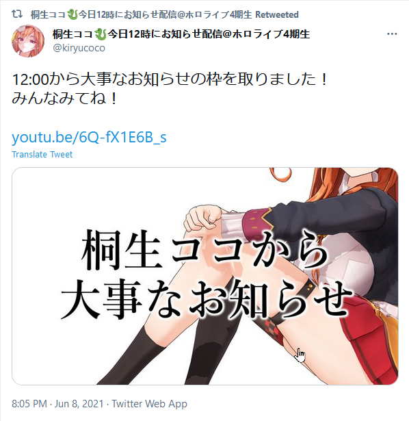
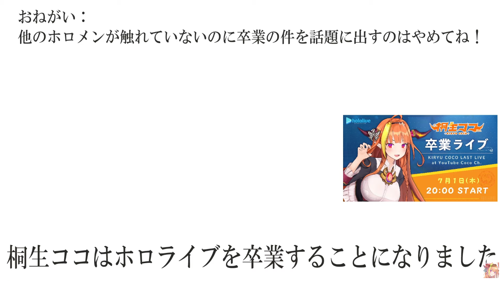
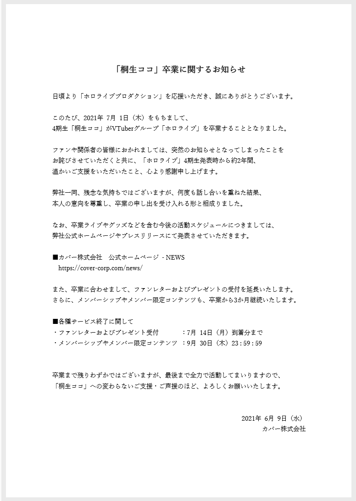

# 01

今日，桐生可可于日本时间11:05发布[推文](https://twitter.com/kiryucoco/status/1402446817321644037)，宣布将有重大事项发表。

之后，在预定的时间，桐生可可表示其准备毕业，宣布其将于日本时间7月1日20:00（晚间8时）进行毕业直播。

# 02

据Cover[日文公告](https://cover-corp.com/news/detail/20210609a/)，此毕业信息真实可靠。

除上述日文公告外，另有[简体中文](https://cover-corp.com/news/detail/20210609c/)、[繁体中文](https://cover-corp.com/news/detail/20210609d/)与[英文](https://cover-corp.com/news/detail/20210609b/)公告同步发表。

其他语言的公告图片，请分别点击以下链接：

[简体中文](img-cover-kiryucoco-graduate-notice-zh-hans.png)
[繁体中文](img-cover-kiryucoco-graduate-notice-zh-hant.png)
[英文](img-cover-kiryucoco-graduate-notice-en.png)