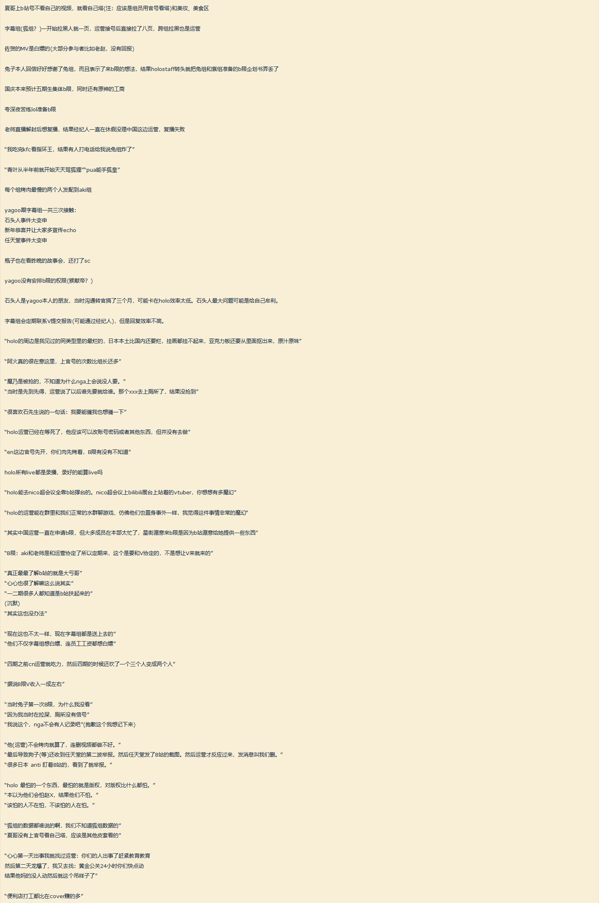

# 以下资料来自字幕组组长互动直播间

- 白上吹雪字幕组封禁的黑名单原本只有不到1页，只有一些语言比较过激的，但运营下场后增加到8页之多，还搞出了跨组封禁
- 夏色祭中之人佐藤希上b站喜欢看自己的塔和美妆、美食区
- HoloCN要切割，10月收益不会给holo抽，不把Holo赶出去HoloCN也会一起死
- 佐贺MV不是商单而是白嫖。只有极少数外人付了钱，大部分都是打白工。
- 五期生国庆本来有计划集体来B限，还有原神的工商，届时holo将会有三四百万的总收入，两亿流水
- 愈月巧可解封后本打算b限复播，但是因为经纪人放假所以没理中国运营，复播失败
- 兔田佩克拉回信感谢字幕组，表示将会B限，但企划书送到后被Staff弄丢，然后就促成了后来兔田佩克拉的炎上事件
- 三十多个字幕组Holo只派了两个运营来管理
- 白上吹雪组组长青叶实际上从半年前就开始天天骂狐狸了
- 石头人是yagoo本人的朋友，当时沟通转官搞了三个月，可能卡在holo效率太低。石头人最大问题可能是给自己牟利。
- 字幕组会定期联系V提交报告(可能通过经纪人)，但是回复效率不高。
- yagoo“没有权限”要求成员来b限。
- (大概是指多数v)“没有能力”自己登陆进cn这边的MC服务器，也不会有这种想法。
- Hololive EN开国内组的时候甚至V都不怎么知情，运营的态度是：翻译先搞，b限不知道，我们争取
- 在桐生可可出事之后立马切割联系，辜负字幕组已经做了很多的准备
- 字幕组人上人的事情大锅在运营

# 以下资料来自于NGA摘录的字幕组组长字幕组组长互动直播间

[点这里查看来源](https://bbs.nga.cn/read.php?pid=460801330&opt=128)

