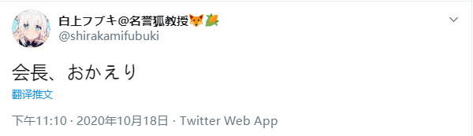

# 01 18日23:10，白上吹雪发布推特消息——“会长，欢迎回来”。

客观上说该行为应该属于对塑造“箱”概念的演者盾之一，但对于国内粉丝来说，基本上产生的都是负面效果。UP并不清楚这代表的是cover对国内市场的误判还是对国内市场的放弃，亦或仅仅为同事之间的正常社交。但这一系列“演者盾”，的确成为了事件爆发的导火索。

**“如果对FBK使用演者盾那我就辞职了哦”**

# 02 18日23:30左右，白上吹雪官组副组长“涼風青葉頑張るぞい”发布字幕组解散声明。 声明中提到“个人为10.06拉黑事件负责”、“账号已移交运营方”、“未得到删除稿件许可”、“为避免法律风险故保留账号稿件”。

[相关链接：【白上吹雪字幕组解散声明】](https://www.bilibili.com/read/cv8002952)

# 03 接上条，该声明引发B站观众不满，在对比原桐生可可官组的解散行为后，观众对白上吹雪官组移交账号、不删库等行为表示不理解，指责白上吹雪官组“跪着死”。并指出删除稿件不会带来收益或法律影响。

# 04 19日15:30左右，伴随着大量观众的指责，白上吹雪官组开始删除账号内稿件。

# 05 19日18:20左右，“涼風青葉頑張るぞい”就字幕组解散原由发布情况说明，说明中梳理了自10月6日以来白上吹雪官组与运营方的交涉，交代了为何未删除稿件的原因，强调其因受到运营误导、不了解创作激励条例以及心存幻想，对字幕组及观众带来了困扰。观众们在此文中了解到了事情始末。

说明中同时提到，删除稿件的行为是在运营方“杰哥”得到“白上吹雪”本人首肯后进行的。观众对这一行为十分不满，再次引发小规模炎上。

[相关链接：【就10.6-10.19的情况进行说明】](https://www.bilibili.com/read/cv8011528)

# 06 至此，hololive所属主播中，在B站拥有最大粉丝数量、具有市场开拓象征意义的白上吹雪，其官方字幕组解散，账号内历史稿件删除。“hololive退出中国市场”这一进程跨出了极大的一步。

# 07 受cover公告、桐生可可复播、演者盾、桐生可可官组及白上吹雪官组删库解散等各种影响，B站hololive观众圈内积攒的愤怒被彻底引爆。除极个别主播*外，所有holo官组均受到粉丝冲击，要求其“体面离开”*，结合各官组成员本身的愤怒*，hololive所属各主播官组如同多米诺骨牌般在数小时内相继删库解散。

详情参见[这里](Fansub-Disband.md)。