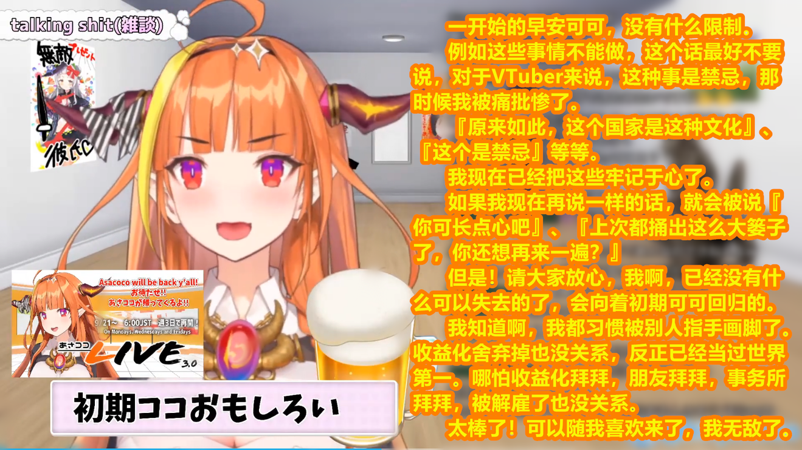
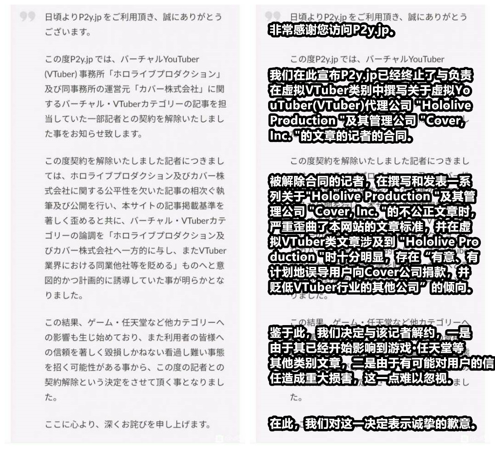
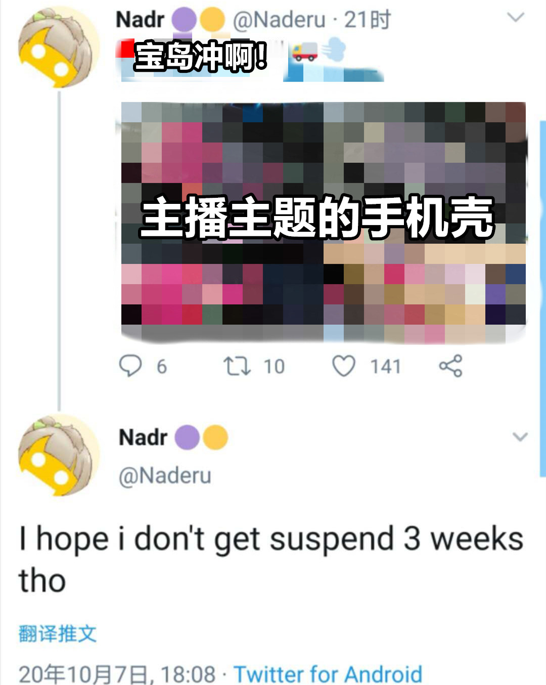
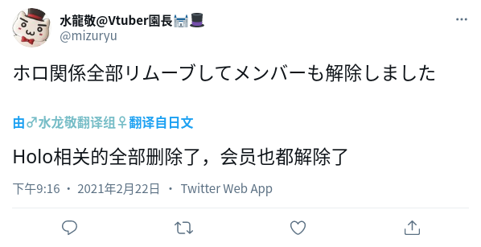
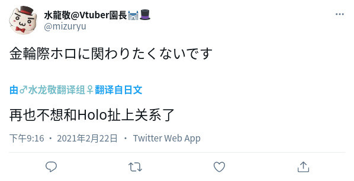
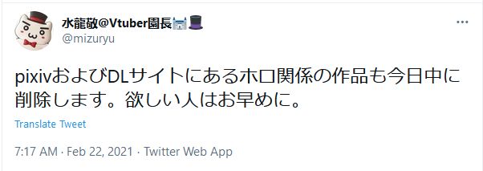
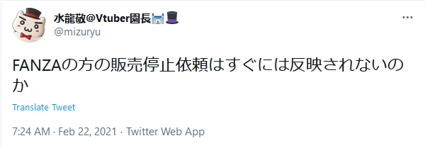
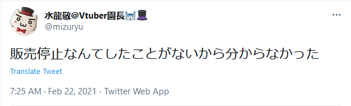
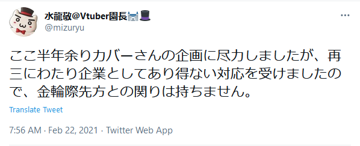
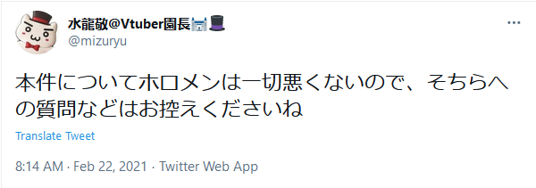

# 01

随着事态进行，桐生可可于9.20发布的“早安可可”相关内容时常被提及，桐生可可于该视频中的部分言论被视为此次炎上事件的“犯罪预告”。

**拜拜**

# 02

日本新闻网站P2y.jp解除旗下某记者合同，该记者在虚拟主播栏目下撰写发表的相关文章存在“有意、有计划地误导用户向Cover公司捐款，并贬低VTuber行业的其他公司”的行为。

[相关链接](https://p2y.jp/notice-of-contract-cancellation-with-some-writers/)

**或许这个记者是hololive死忠粉吧**

# 03

holostars成员律可，其中之人于近日在B站使用个人账号直播游玩《原神》，结合各方情报，《原神》禁止hololive成员直播一事越发清晰。

# 04

近日hololive所属主播三人口嗨事件被炎上，三人当日于推特迅速道歉，与桐生可可形成鲜明对比1。

1. 该次炎上事件与桐生可可无关且事情已经结束，故在此不具体提及。

# 05

2020年10月07日晚间，hololive所属某主播在推特点赞某涉敏钓鱼fanart推文1，在该用户恶意回复“希望我不要被ban三周”后反应过来并取消点赞，事情引起极小规模炎上，事后该用户删除原推并发文道歉2。

1. 【fanart】可理解为粉丝为主播制作的相关艺术作品，其形式多样，多为制作完成后以图片或视频形式发送给主播，主播经常会点赞或回复该类推文。

2. hololive及其旗下主播的警惕意识也越来越高了。

**炎上期间，该类消息层出不穷。**

# 06

2020年10月21日，樱巫女进行复播live。由于对IM@S（偶像大师）名曲的翻唱，引起日本小炎上。由于桐生可可曾非法收益化直播偶像大师，此事被乐子人视为可以利用。

# 07

2021年2月22日，水龙敬老师（Hololive旗下Vtuber宝钟玛琳）突然发布多则推文，宣布将删除与Hololive有关的作品，并直接指出与Cover在近半年的合作中，对方的态度十分不专业。

同时，水龙敬老师表示，此事与Vtuber本人无关。

以下是水龙敬老师的推文及翻译。包含一部分已经被水龙敬老师删除的推文。

Pixiv与DL网站上的和Holo相关的内容也将在今天之内删除。想要的人请尽快吧。

FANZA站的下架请求不是立刻生效的？

我不是很了解，我从没有停止销售过。

